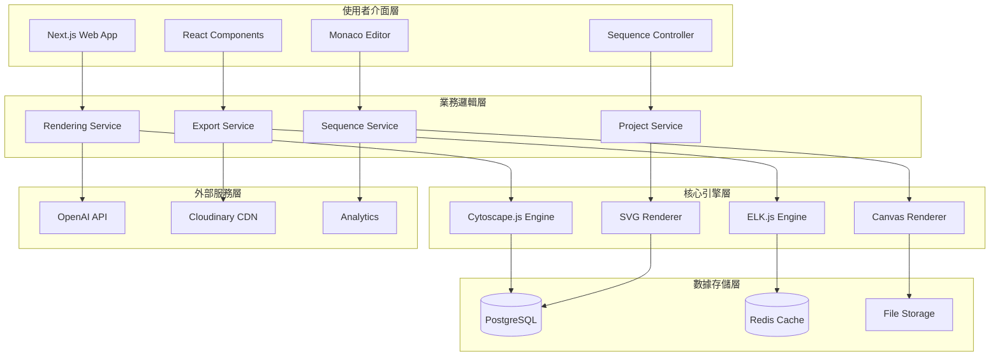

# Mermaid-Render 技術架構總覽

本文件為 Mermaid-Render 平台的技術架構總覽，整合了系統架構、渲染引擎、匯出系統、以及未來擴展功能的完整設計。

## 📋 架構文件索引

### 核心架構文件
- **[系統架構設計](./architecture/system-architecture.md)** - 完整的系統架構與服務層設計
- **[技術棧詳細說明](./architecture/tech-stack.md)** - 前後端技術棧與工具選擇
- **[程式碼規範](./architecture/coding-standards.md)** - 開發標準與程式碼品質規範
- **[目錄結構規範](./architecture/source-tree.md)** - 專案目錄組織與檔案命名

### 專門系統設計
- **[渲染引擎架構](./architecture/rendering-engine.md)** - 可擴展的多引擎渲染系統
- **[高效能匯出系統](./architecture/export-system.md)** - 無截斷多格式匯出架構
- **[未來功能擴展接口](./architecture/future-extensions.md)** - Phase 2/3 功能的預留接口

## 🎯 專案概述

### 核心目標
Mermaid-Render 致力於成為業界最可靠的 Mermaid 圖表渲染解決方案，解決現有工具的根本性問題：

1. **語法容錯問題** - 智能語法修復，99%+ 相容性
2. **PNG 匯出截斷** - 無截斷的高品質圖片匯出
3. **複雜關聯線混亂** - 智能佈局演算法優化
4. **缺乏互動展示** - 革命性的序列展示功能

### 技術特色
- **漸進式微服務架構** - MVP 快速交付，預留微服務拆分路徑
- **可插拔渲染引擎** - 支援 Cytoscape.js、ELK.js 等多種引擎
- **智能匯出系統** - 分塊處理、Worker 優化、多格式支援
- **序列展示創新** - 業界首創的編號化互動展示模式

## 🏗️ 整體架構

### 系統分層架構



### 核心服務架構

| 服務層 | 職責 | 技術選型 | 擴展策略 |
|--------|------|----------|----------|
| **前端層** | 使用者介面、互動體驗 | Next.js 14 + TypeScript | SSG/SSR 混合模式 |
| **API層** | 業務邏輯、資料處理 | Fastify + Prisma ORM | RESTful API + GraphQL 預留 |
| **渲染層** | 圖表渲染、佈局計算 | Cytoscape.js + ELK.js | 插件化引擎架構 |
| **匯出層** | 圖片生成、格式轉換 | Canvas + SVG + Worker | 分塊處理 + 雲端處理 |
| **儲存層** | 資料持久化、快取 | PostgreSQL + Redis | 讀寫分離 + 分散式快取 |

## 🔧 核心系統特色

### 1. 可插拔渲染引擎
```typescript
// 統一渲染引擎介面
interface RenderEngine {
  name: string;
  capabilities: EngineCapability[];
  
  render(data: GraphData): Promise<RenderResult>;
  export(format: ExportFormat): Promise<ExportResult>;
  showSequence(sequence: SequenceStep[]): Promise<void>;
}

// 支援的引擎類型
- Cytoscape.js Engine: 通用圖表渲染，支援複雜互動
- ELK.js Engine: 階層佈局專精，大型圖表優化  
- 未來引擎: WebGL 加速、3D 渲染等
```

### 2. 智能匯出系統
- **策略選擇**: 根據圖表大小自動選擇最佳匯出策略
- **無截斷保證**: 支援任意大小圖表的完整匯出
- **多格式支援**: PNG, SVG, JPEG, WebP, PDF
- **高效能處理**: 分塊處理、Worker 優化、異步匯出

### 3. 序列展示系統
- **三種模式**: 區域、節點、關聯線依序展示
- **播放控制**: 播放/暫停/跳轉/速度調整
- **動畫效果**: 平滑過渡、高亮聚焦、視角切換
- **互動控制**: 鍵盤快速鍵、進度指示器

## 🚀 技術棧總覽

### 前端技術棧
```typescript
{
  // 核心框架
  "framework": "Next.js 14",
  "runtime": "React 18", 
  "language": "TypeScript 5.0+",
  
  // UI 與樣式
  "styling": "Tailwind CSS 3.0+",
  "components": "Radix UI",
  "animations": "Framer Motion",
  
  // 圖形渲染
  "rendering": ["Cytoscape.js", "ELK.js"],
  "editor": "Monaco Editor",
  
  // 狀態管理
  "state": "Zustand",
  "server-state": "TanStack Query"
}
```

### 後端技術棧
```typescript
{
  // 運行環境
  "runtime": "Node.js 20+",
  "framework": "Fastify",
  
  // 資料庫
  "database": "PostgreSQL 15",
  "orm": "Prisma",
  "cache": "Redis 7",
  
  // AI 整合
  "ai": ["OpenAI API", "LangChain"],
  
  // 監控分析  
  "monitoring": "Sentry",
  "analytics": "Vercel Analytics"
}
```

## 📈 效能指標

### 核心效能指標
- **渲染效能**: < 500ms (1000 節點圖表)
- **匯出速度**: < 5 秒 (PNG 高解析度) 
- **記憶體使用**: < 100MB (一般圖表)
- **載入時間**: < 2 秒 (初始載入)

### 優化策略
- **視窗剔除**: 只渲染可見區域
- **分塊處理**: 超大圖表分塊合併
- **Worker 處理**: 避免 UI 阻塞
- **智能快取**: 多層快取策略

## 🔮 未來功能規劃

### Phase 2: 心智圖整合 (3-6 個月)
- 心智圖引擎開發
- XMind 解析器實現
- 格式轉換與同步
- 多圖表類型支援

### Phase 3: AI 驅動功能 (6-12 個月)
- 自然語言轉圖表
- 智能佈局優化
- 圖表自動擴展
- 子圖表導航系統

## 🚀 部署與維運

### 生產環境架構
```yaml
# 部署配置
frontend:
  platform: Vercel
  features: [SSG, SSR, Edge Functions]
  
api:
  platform: Railway/Render
  scaling: Horizontal
  
database:
  service: Supabase PostgreSQL
  backup: Daily automated
  
cache:
  service: Upstash Redis
  clustering: Yes
```

### CI/CD 流程
1. **程式碼檢查**: ESLint, TypeScript, 測試
2. **建置**: Next.js 建置 + Docker 映像檔  
3. **測試**: 單元測試 + 整合測試 + E2E 測試
4. **部署**: 藍綠部署 + 健康檢查
5. **監控**: 效能監控 + 錯誤追蹤

## 🔒 安全性設計

### 安全措施
- **資料加密**: 傳輸加密 (HTTPS) + 儲存加密
- **認證授權**: JWT + OAuth 2.0 + RBAC
- **輸入驗證**: Zod 驗證 + XSS 防護
- **API 安全**: 速率限制 + CORS + CSP

## 💡 開發最佳實踐

### 程式碼品質
- **類型安全**: 全程 TypeScript + Zod 驗證
- **測試覆蓋**: 單元測試 + 整合測試 > 80%
- **效能優先**: 每個功能都考慮效能影響
- **使用者體驗**: 載入狀態 + 錯誤處理

### 架構原則
1. **API 優先設計** - 先設計 API 再實現功能
2. **漸進式微服務** - MVP 快速交付，預留拆分路徑
3. **插件化擴展** - 核心功能可獨立擴展
4. **向後相容** - 新功能不影響現有功能

## 🎯 開發里程碑

### Phase 1: MVP (4 週) ✅
- 基礎架構 + 核心渲染
- 匯出系統 + 序列展示  
- UI 優化 + 測試部署

### Phase 2: 擴展功能 (8 週)
- 心智圖引擎開發
- XMind 整合實現
- 多格式支援優化

### Phase 3: AI 功能 (12 週)  
- AI 服務架構
- 自然語言處理
- 子圖表導航系統

## 📚 參考文件

### 詳細設計文件
- [系統架構設計](./architecture/system-architecture.md) - 完整的系統架構設計
- [渲染引擎架構](./architecture/rendering-engine.md) - 可擴展的渲染引擎
- [匯出系統架構](./architecture/export-system.md) - 高效能匯出系統  
- [未來功能接口](./architecture/future-extensions.md) - Phase 2/3 擴展接口

### 技術規範
- [技術棧說明](./architecture/tech-stack.md) - 技術選型詳細說明
- [程式碼規範](./architecture/coding-standards.md) - 開發標準
- [目錄結構](./architecture/source-tree.md) - 專案組織規範

---

## 🎉 總結

Mermaid-Render 的技術架構充分考慮了：

✅ **可擴展性** - 從 MVP 到完整功能的平滑演進路徑  
✅ **高效能** - 針對大型圖表和高並發的優化設計  
✅ **可維護性** - 模組化架構和統一的開發規範  
✅ **使用者體驗** - 響應式設計和直觀的互動體驗  
✅ **未來準備** - 為 AI、協作、擴展功能預留完整接口  

這個架構不僅能支持當前的 MVP 需求，更為未來 2-3 年的功能發展奠定了堅實的技術基礎。

*本架構文件將隨著專案發展持續更新，確保技術決策與業務目標保持一致。*