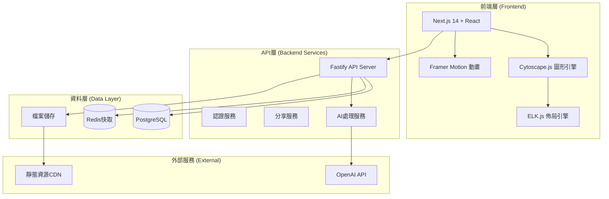

# Mermaid-Render 技術架構文件

## 整體架構概覽



## 核心技術選擇說明

### 1. 前端架構

#### Next.js 14 (App Router)
**選擇理由：**
- 內建SSR支援分享連結預覽
- 優秀的SEO與性能優化
- 強大的檔案系統路由
- 邊緣運算支援

**關鍵配置：**
```typescript
// next.config.js
const nextConfig = {
  experimental: {
    appDir: true,
  },
  webpack: (config) => {
    // Cytoscape.js優化配置
    config.externals.push({
      canvas: 'canvas',
    });
    return config;
  }
};
```

#### Cytoscape.js + ELK.js
**選擇理由：**
- Cytoscape.js：業界最強大的圖形渲染引擎
- ELK.js：專業級分層佈局演算法
- 完美支援大規模節點與動畫

**核心整合架構：**
```typescript
interface GraphRenderer {
  // Mermaid解析器
  parser: MermaidParser;
  // 佈局引擎
  layoutEngine: ELKLayoutEngine;
  // 渲染引擎
  cytoscape: CytoscapeRenderer;
  // 動畫控制器
  animator: GraphAnimator;
}
```

### 2. 後端服務架構

#### API服務設計
```typescript
// 核心服務模組
interface Services {
  graphService: GraphService;      // 圖表CRUD
  aiService: AIService;           // AI處理
  shareService: ShareService;     // 分享功能
  userService: UserService;       // 使用者管理
}
```

#### 資料庫Schema設計
```sql
-- 圖表主表
CREATE TABLE graphs (
  id UUID PRIMARY KEY,
  title VARCHAR(255) NOT NULL,
  mermaid_content TEXT NOT NULL,
  layout_config JSONB,
  view_state JSONB,
  created_at TIMESTAMP DEFAULT NOW(),
  updated_at TIMESTAMP DEFAULT NOW()
);

-- 分享連結表
CREATE TABLE shared_graphs (
  id UUID PRIMARY KEY,
  graph_id UUID REFERENCES graphs(id),
  short_code VARCHAR(20) UNIQUE,
  is_public BOOLEAN DEFAULT true,
  expires_at TIMESTAMP,
  view_count INTEGER DEFAULT 0
);

-- AI處理記錄
CREATE TABLE ai_generations (
  id UUID PRIMARY KEY,
  graph_id UUID REFERENCES graphs(id),
  input_prompt TEXT,
  generated_mermaid TEXT,
  model_used VARCHAR(50),
  created_at TIMESTAMP DEFAULT NOW()
);
```

## 核心功能模組設計

### 1. Mermaid解析器
```typescript
class MermaidParser {
  parse(mermaidText: string): GraphData {
    // 解析Mermaid語法
    // 轉換為標準化的節點/邊資料結構
  }
  
  generateMermaid(graphData: GraphData): string {
    // 反向生成Mermaid語法
  }
}

interface GraphData {
  nodes: Node[];
  edges: Edge[];
  subgraphs: Subgraph[];
  styling: StylingConfig;
}
```

### 2. 展示模式控制器
```typescript
class DisplayController {
  // 序列播放控制
  playSequence(edges: Edge[], speed: number): void;
  
  // 端點靠攏動畫
  animateNodeApproach(edge: Edge): Promise<void>;
  
  // 相機飛行
  flyToRegion(region: string): Promise<void>;
  
  // 色彩漸變系統
  applyColorSequence(sequence: number[]): void;
}
```

### 3. AI服務整合
```typescript
class AIService {
  // 自然語言轉Mermaid
  async textToMermaid(description: string): Promise<string>;
  
  // 圖表優化建議
  async optimizeLayout(graphData: GraphData): Promise<OptimizationSuggestion>;
  
  // 自動重構
  async refactorGraph(mermaid: string, rules: RefactorRule[]): Promise<string>;
}
```

## 性能優化策略

### 1. 前端優化
- **虛擬化渲染**：大規模節點分批載入
- **Canvas優化**：WebGL加速渲染
- **記憶體管理**：及時清理未使用的圖形物件

### 2. 後端優化
- **Redis快取**：熱門圖表預載入
- **CDN加速**：靜態資源分發
- **資料庫優化**：適當索引與查詢優化

### 3. AI服務優化
- **請求合併**：批次處理AI請求
- **結果快取**：相似請求快取復用
- **降級方案**：AI服務失效時的備用方案

## 部署架構

### 開發環境
```yaml
services:
  frontend:
    build: ./
    ports: ["3000:3000"]
  
  api:
    build: ./api
    ports: ["8000:8000"]
  
  postgres:
    image: postgres:15
    ports: ["5432:5432"]
  
  redis:
    image: redis:7
    ports: ["6379:6379"]
```

### 生產環境
- **前端**：Vercel邊緣部署
- **API**：Railway/Render容器部署
- **資料庫**：Supabase PostgreSQL
- **快取**：Upstash Redis
- **CDN**：Cloudflare

## 安全考量

### 1. 資料安全
- 所有API請求需要認證
- 敏感資料加密儲存
- CORS政策嚴格控制

### 2. AI使用安全
- 輸入內容過濾
- API使用量監控
- 敏感資訊檢測

### 3. 分享安全
- 分享連結過期機制
- 訪問權限控制
- 惡意內容檢測

---

*此架構文件將隨開發進展持續演進*