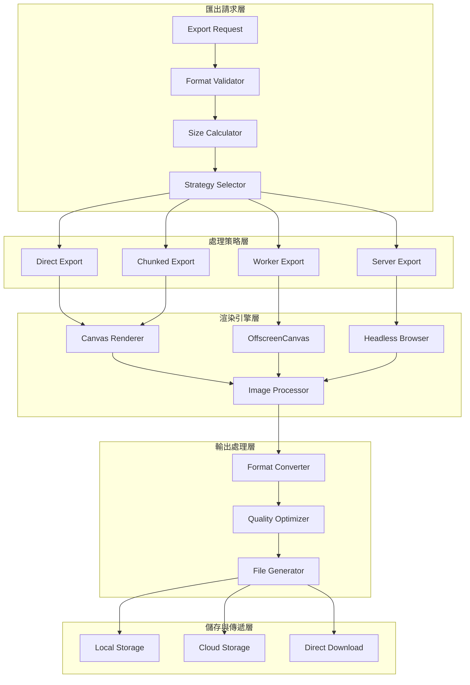

# 高效能匯出系統架構設計

本文件詳細說明 Mermaid-Render 平台的高效能匯出系統架構，解決現有工具的 PNG 截斷問題，並提供可擴展的多格式匯出能力。

## 匯出系統概覽

### 設計目標
- **無截斷匯出**：支援任意大小圖表的完整匯出
- **多格式支援**：PNG、SVG、PDF、WebP 等格式
- **高效能處理**：大型圖表分塊處理，異步匯出
- **品質保證**：高解析度匯出，可自定義 DPI
- **用戶體驗**：進度提示、預覽功能、批量處理

### 核心架構



## 核心接口設計

### 匯出服務主接口

```typescript
// 匯出服務主接口
export interface ExportService {
  // 基本匯出功能
  export(
    graphData: GraphData,
    format: ExportFormat,
    options?: ExportOptions
  ): Promise<ExportResult>;
  
  // 批量匯出
  exportBatch(
    requests: ExportRequest[]
  ): Promise<BatchExportResult>;
  
  // 預覽功能
  generatePreview(
    graphData: GraphData,
    format: ExportFormat,
    options?: PreviewOptions
  ): Promise<PreviewResult>;
  
  // 匯出進度追蹤
  getExportProgress(jobId: string): Promise<ExportProgress>;
  
  // 取消匯出
  cancelExport(jobId: string): Promise<boolean>;
  
  // 支援的格式查詢
  getSupportedFormats(): ExportFormat[];
  
  // 格式特定選項
  getFormatOptions(format: ExportFormat): ExportFormatOptions;
}

// 匯出格式定義
export enum ExportFormat {
  PNG = 'png',
  SVG = 'svg',
  PDF = 'pdf',
  WEBP = 'webp',
  JPEG = 'jpeg',
  // 未來格式
  TIFF = 'tiff',
  EPS = 'eps',
  EMF = 'emf'
}

// 匯出選項
export interface ExportOptions {
  // 基本設定
  width?: number;
  height?: number;
  scale?: number;
  dpi?: number;
  
  // 品質設定
  quality?: number; // 0-1, for JPEG/WebP
  compression?: number; // 0-9, for PNG
  
  // 背景設定
  backgroundColor?: string;
  transparent?: boolean;
  
  // 內容設定
  includeLabels?: boolean;
  includeBackground?: boolean;
  cropToContent?: boolean;
  padding?: number;
  
  // 進階選項
  antialiasing?: boolean;
  subpixelRendering?: boolean;
  textRendering?: 'auto' | 'optimizeSpeed' | 'optimizeLegibility';
  
  // 分塊設定（大型圖表）
  enableChunking?: boolean;
  maxChunkSize?: number;
  chunkOverlap?: number;
  
  // 異步處理
  async?: boolean;
  priority?: 'low' | 'normal' | 'high';
  
  // 回調函數
  onProgress?: (progress: ExportProgress) => void;
  onComplete?: (result: ExportResult) => void;
  onError?: (error: Error) => void;
}

// 匯出結果
export interface ExportResult {
  success: boolean;
  jobId?: string;
  
  // 結果數據
  data?: Blob | string; // Blob for binary, string for SVG
  dataUrl?: string;
  downloadUrl?: string;
  
  // 元數據
  format: ExportFormat;
  dimensions: { width: number; height: number };
  fileSize: number;
  processingTime: number;
  
  // 品質指標
  actualDpi?: number;
  compressionRatio?: number;
  
  // 錯誤資訊
  error?: string;
  warnings?: string[];
  
  // 調試資訊
  debugInfo?: {
    renderTime: number;
    conversionTime: number;
    compressionTime: number;
    chunks?: number;
    memoryUsage?: number;
  };
}
```

### 匯出策略設計

```typescript
// 匯出策略選擇器
export class ExportStrategySelector {
  selectStrategy(
    graphData: GraphData,
    format: ExportFormat,
    options: ExportOptions
  ): ExportStrategy {
    const dimensions = this.calculateDimensions(graphData, options);
    const complexity = this.assessComplexity(graphData);
    const memoryRequired = this.estimateMemoryUsage(dimensions, format);
    
    // 策略選擇邏輯
    if (this.shouldUseServerExport(memoryRequired, complexity)) {
      return new ServerExportStrategy();
    } else if (this.shouldUseWorkerExport(memoryRequired, dimensions)) {
      return new WorkerExportStrategy();
    } else if (this.shouldUseChunkedExport(dimensions, memoryRequired)) {
      return new ChunkedExportStrategy();
    } else {
      return new DirectExportStrategy();
    }
  }
  
  private shouldUseServerExport(
    memoryRequired: number, 
    complexity: ComplexityMetrics
  ): boolean {
    // 超大圖表或複雜度過高使用伺服器處理
    return memoryRequired > 500 * 1024 * 1024 || // 500MB
           complexity.nodeCount > 5000 ||
           complexity.edgeCount > 10000;
  }
  
  private shouldUseWorkerExport(
    memoryRequired: number,
    dimensions: Dimensions
  ): boolean {
    // 中大型圖表使用 Worker 避免阻塞 UI
    return memoryRequired > 50 * 1024 * 1024 || // 50MB
           dimensions.width > 4096 ||
           dimensions.height > 4096;
  }
  
  private shouldUseChunkedExport(
    dimensions: Dimensions,
    memoryRequired: number
  ): boolean {
    // 超過 Canvas 限制或記憶體不足使用分塊
    const maxCanvasSize = this.getMaxCanvasSize();
    return dimensions.width > maxCanvasSize.width ||
           dimensions.height > maxCanvasSize.height ||
           memoryRequired > 100 * 1024 * 1024; // 100MB
  }
}

// 匯出策略基礎接口
export abstract class ExportStrategy {
  abstract export(
    graphData: GraphData,
    format: ExportFormat,
    options: ExportOptions
  ): Promise<ExportResult>;
  
  protected calculateOptimalDimensions(
    graphData: GraphData,
    options: ExportOptions
  ): Dimensions {
    // 計算圖表實際邊界
    const bounds = this.calculateGraphBounds(graphData);
    
    // 應用填充
    const padding = options.padding || 20;
    const paddedBounds = {
      width: bounds.width + padding * 2,
      height: bounds.height + padding * 2
    };
    
    // 應用縮放
    const scale = options.scale || 1;
    
    // 應用 DPI 縮放
    const dpiScale = (options.dpi || 96) / 96;
    
    return {
      width: Math.ceil(paddedBounds.width * scale * dpiScale),
      height: Math.ceil(paddedBounds.height * scale * dpiScale)
    };
  }
  
  protected estimateMemoryUsage(
    dimensions: Dimensions,
    format: ExportFormat
  ): number {
    // 基礎記憶體計算（4 bytes per pixel for RGBA）
    const pixelCount = dimensions.width * dimensions.height;
    let memoryUsage = pixelCount * 4;
    
    // 格式特定調整
    switch (format) {
      case ExportFormat.PNG:
        memoryUsage *= 1.5; // 壓縮緩衝
        break;
      case ExportFormat.JPEG:
      case ExportFormat.WEBP:
        memoryUsage *= 1.2;
        break;
      case ExportFormat.SVG:
        memoryUsage *= 0.1; // 向量格式記憶體需求較少
        break;
    }
    
    return memoryUsage;
  }
}
```

## 直接匯出策略

### DirectExportStrategy 實現

```typescript
export class DirectExportStrategy extends ExportStrategy {
  async export(
    graphData: GraphData,
    format: ExportFormat,
    options: ExportOptions
  ): Promise<ExportResult> {
    const startTime = performance.now();
    const jobId = this.generateJobId();
    
    try {
      // 計算最佳尺寸
      const dimensions = this.calculateOptimalDimensions(graphData, options);
      
      // 建立離屏 Canvas
      const canvas = this.createOffscreenCanvas(dimensions);
      const ctx = canvas.getContext('2d')!;
      
      // 設定渲染選項
      this.setupCanvasContext(ctx, options);
      
      // 渲染圖表到 Canvas
      await this.renderToCanvas(ctx, graphData, options);
      
      // 轉換為目標格式
      const result = await this.convertCanvasToFormat(canvas, format, options);
      
      const processingTime = performance.now() - startTime;
      
      return {
        success: true,
        jobId,
        data: result.data,
        dataUrl: result.dataUrl,
        format,
        dimensions,
        fileSize: result.fileSize,
        processingTime,
        actualDpi: options.dpi || 96,
        debugInfo: {
          renderTime: result.renderTime,
          conversionTime: result.conversionTime,
          compressionTime: result.compressionTime,
          memoryUsage: this.estimateMemoryUsage(dimensions, format)
        }
      };
      
    } catch (error) {
      return {
        success: false,
        jobId,
        format,
        dimensions: { width: 0, height: 0 },
        fileSize: 0,
        processingTime: performance.now() - startTime,
        error: error.message
      };
    }
  }
  
  private createOffscreenCanvas(dimensions: Dimensions): OffscreenCanvas {
    if ('OffscreenCanvas' in window) {
      return new OffscreenCanvas(dimensions.width, dimensions.height);
    } else {
      // Fallback for older browsers
      const canvas = document.createElement('canvas');
      canvas.width = dimensions.width;
      canvas.height = dimensions.height;
      return canvas as any;
    }
  }
  
  private setupCanvasContext(
    ctx: CanvasRenderingContext2D | OffscreenCanvasRenderingContext2D,
    options: ExportOptions
  ): void {
    // 設定抗鋸齒
    if (options.antialiasing !== false) {
      (ctx as any).imageSmoothingEnabled = true;
      (ctx as any).imageSmoothingQuality = 'high';
    }
    
    // 設定文字渲染
    if (options.textRendering) {
      (ctx as any).textRenderingOptimization = options.textRendering;
    }
    
    // 設定背景
    if (options.backgroundColor && !options.transparent) {
      ctx.fillStyle = options.backgroundColor;
      ctx.fillRect(0, 0, ctx.canvas.width, ctx.canvas.height);
    }
  }
  
  private async renderToCanvas(
    ctx: CanvasRenderingContext2D | OffscreenCanvasRenderingContext2D,
    graphData: GraphData,
    options: ExportOptions
  ): Promise<void> {
    // 建立圖表渲染器
    const renderer = new CanvasGraphRenderer(ctx);
    
    // 設定渲染選項
    renderer.setOptions({
      includeLabels: options.includeLabels ?? true,
      includeBackground: options.includeBackground ?? true,
      scale: options.scale || 1,
      dpi: options.dpi || 96
    });
    
    // 渲染圖表
    await renderer.render(graphData);
  }
  
  private async convertCanvasToFormat(
    canvas: OffscreenCanvas | HTMLCanvasElement,
    format: ExportFormat,
    options: ExportOptions
  ): Promise<ConversionResult> {
    const startTime = performance.now();
    
    switch (format) {
      case ExportFormat.PNG:
        return this.convertToPNG(canvas, options);
      case ExportFormat.JPEG:
        return this.convertToJPEG(canvas, options);
      case ExportFormat.WEBP:
        return this.convertToWebP(canvas, options);
      case ExportFormat.SVG:
        return this.convertToSVG(canvas, options);
      default:
        throw new Error(`Unsupported format: ${format}`);
    }
  }
  
  private async convertToPNG(
    canvas: OffscreenCanvas | HTMLCanvasElement,
    options: ExportOptions
  ): Promise<ConversionResult> {
    const startTime = performance.now();
    
    let blob: Blob;
    if (canvas instanceof OffscreenCanvas) {
      blob = await canvas.convertToBlob({
        type: 'image/png',
        // PNG 不支援 quality 參數，但可以透過後處理壓縮
      });
    } else {
      blob = await new Promise<Blob>((resolve) => {
        canvas.toBlob((blob) => resolve(blob!), 'image/png');
      });
    }
    
    // 應用自定義壓縮
    if (options.compression && options.compression > 0) {
      blob = await this.compressPNG(blob, options.compression);
    }
    
    const dataUrl = await this.blobToDataUrl(blob);
    const conversionTime = performance.now() - startTime;
    
    return {
      data: blob,
      dataUrl,
      fileSize: blob.size,
      conversionTime,
      renderTime: 0,
      compressionTime: options.compression ? conversionTime * 0.3 : 0
    };
  }
  
  private async convertToJPEG(
    canvas: OffscreenCanvas | HTMLCanvasElement,
    options: ExportOptions
  ): Promise<ConversionResult> {
    const quality = options.quality || 0.9;
    
    let blob: Blob;
    if (canvas instanceof OffscreenCanvas) {
      blob = await canvas.convertToBlob({
        type: 'image/jpeg',
        quality
      });
    } else {
      blob = await new Promise<Blob>((resolve) => {
        canvas.toBlob((blob) => resolve(blob!), 'image/jpeg', quality);
      });
    }
    
    const dataUrl = await this.blobToDataUrl(blob);
    
    return {
      data: blob,
      dataUrl,
      fileSize: blob.size,
      conversionTime: 0,
      renderTime: 0,
      compressionTime: 0
    };
  }
}
```

## 分塊匯出策略

### ChunkedExportStrategy 實現

```typescript
export class ChunkedExportStrategy extends ExportStrategy {
  async export(
    graphData: GraphData,
    format: ExportFormat,
    options: ExportOptions
  ): Promise<ExportResult> {
    const startTime = performance.now();
    const jobId = this.generateJobId();
    
    try {
      // 計算完整尺寸
      const fullDimensions = this.calculateOptimalDimensions(graphData, options);
      
      // 計算分塊策略
      const chunkStrategy = this.calculateChunkStrategy(fullDimensions, options);
      
      // 初始化進度追蹤
      const progressTracker = new ProgressTracker(chunkStrategy.totalChunks);
      
      // 並行渲染各區塊
      const chunkResults = await this.renderChunksInParallel(
        graphData,
        chunkStrategy,
        options,
        progressTracker
      );
      
      // 合併區塊
      const mergedResult = await this.mergeChunks(
        chunkResults,
        chunkStrategy,
        format,
        options
      );
      
      const processingTime = performance.now() - startTime;
      
      return {
        success: true,
        jobId,
        data: mergedResult.data,
        dataUrl: mergedResult.dataUrl,
        format,
        dimensions: fullDimensions,
        fileSize: mergedResult.fileSize,
        processingTime,
        debugInfo: {
          renderTime: mergedResult.totalRenderTime,
          conversionTime: mergedResult.conversionTime,
          compressionTime: mergedResult.compressionTime,
          chunks: chunkStrategy.totalChunks,
          memoryUsage: this.estimateMemoryUsage(fullDimensions, format)
        }
      };
      
    } catch (error) {
      return {
        success: false,
        jobId,
        format,
        dimensions: { width: 0, height: 0 },
        fileSize: 0,
        processingTime: performance.now() - startTime,
        error: error.message
      };
    }
  }
  
  private calculateChunkStrategy(
    dimensions: Dimensions,
    options: ExportOptions
  ): ChunkStrategy {
    const maxChunkSize = options.maxChunkSize || 2048; // 2K per chunk
    const overlap = options.chunkOverlap || 50; // 50px overlap
    
    // 計算需要的區塊數
    const chunksX = Math.ceil(dimensions.width / (maxChunkSize - overlap));
    const chunksY = Math.ceil(dimensions.height / (maxChunkSize - overlap));
    
    const chunks: ChunkInfo[] = [];
    
    for (let y = 0; y < chunksY; y++) {
      for (let x = 0; x < chunksX; x++) {
        const startX = x * (maxChunkSize - overlap);
        const startY = y * (maxChunkSize - overlap);
        const endX = Math.min(startX + maxChunkSize, dimensions.width);
        const endY = Math.min(startY + maxChunkSize, dimensions.height);
        
        chunks.push({
          id: `chunk_${x}_${y}`,
          bounds: {
            x: startX,
            y: startY,
            width: endX - startX,
            height: endY - startY
          },
          gridPosition: { x, y },
          overlap: {
            left: x > 0 ? overlap / 2 : 0,
            top: y > 0 ? overlap / 2 : 0,
            right: x < chunksX - 1 ? overlap / 2 : 0,
            bottom: y < chunksY - 1 ? overlap / 2 : 0
          }
        });
      }
    }
    
    return {
      totalChunks: chunks.length,
      chunksX,
      chunksY,
      chunkSize: maxChunkSize,
      overlap,
      chunks
    };
  }
  
  private async renderChunksInParallel(
    graphData: GraphData,
    strategy: ChunkStrategy,
    options: ExportOptions,
    progressTracker: ProgressTracker
  ): Promise<ChunkRenderResult[]> {
    // 限制並行數量避免記憶體溢出
    const maxConcurrency = 4;
    const results: ChunkRenderResult[] = [];
    
    for (let i = 0; i < strategy.chunks.length; i += maxConcurrency) {
      const batch = strategy.chunks.slice(i, i + maxConcurrency);
      
      const batchPromises = batch.map(chunk => 
        this.renderSingleChunk(chunk, graphData, options, progressTracker)
      );
      
      const batchResults = await Promise.all(batchPromises);
      results.push(...batchResults);
      
      // 通知進度
      progressTracker.updateProgress(results.length);
      options.onProgress?.(progressTracker.getProgress());
    }
    
    return results;
  }
  
  private async renderSingleChunk(
    chunk: ChunkInfo,
    graphData: GraphData,
    options: ExportOptions,
    progressTracker: ProgressTracker
  ): Promise<ChunkRenderResult> {
    const startTime = performance.now();
    
    // 建立區塊專用 Canvas
    const canvas = new OffscreenCanvas(chunk.bounds.width, chunk.bounds.height);
    const ctx = canvas.getContext('2d')!;
    
    // 設定變換矩陣（將圖表適當部分渲染到區塊）
    ctx.translate(-chunk.bounds.x, -chunk.bounds.y);
    
    // 篩選該區塊內的圖表元素
    const filteredData = this.filterGraphDataByBounds(graphData, chunk.bounds);
    
    // 渲染區塊
    const renderer = new CanvasGraphRenderer(ctx);
    await renderer.render(filteredData);
    
    // 轉換為 ImageData
    const imageData = ctx.getImageData(0, 0, chunk.bounds.width, chunk.bounds.height);
    
    const renderTime = performance.now() - startTime;
    
    return {
      chunkId: chunk.id,
      imageData,
      bounds: chunk.bounds,
      renderTime
    };
  }
  
  private async mergeChunks(
    chunkResults: ChunkRenderResult[],
    strategy: ChunkStrategy,
    format: ExportFormat,
    options: ExportOptions
  ): Promise<MergeResult> {
    const startTime = performance.now();
    
    // 建立完整尺寸的 Canvas
    const fullDimensions = this.calculateFullDimensions(strategy);
    const mergeCanvas = new OffscreenCanvas(fullDimensions.width, fullDimensions.height);
    const mergeCtx = mergeCanvas.getContext('2d')!;
    
    // 設定背景
    if (options.backgroundColor && !options.transparent) {
      mergeCtx.fillStyle = options.backgroundColor;
      mergeCtx.fillRect(0, 0, fullDimensions.width, fullDimensions.height);
    }
    
    // 合併各區塊
    for (const result of chunkResults) {
      // 建立臨時 Canvas 來處理 ImageData
      const tempCanvas = new OffscreenCanvas(
        result.bounds.width, 
        result.bounds.height
      );
      const tempCtx = tempCanvas.getContext('2d')!;
      tempCtx.putImageData(result.imageData, 0, 0);
      
      // 複製到主 Canvas
      mergeCtx.drawImage(
        tempCanvas,
        result.bounds.x,
        result.bounds.y
      );
    }
    
    // 轉換為目標格式
    const blob = await mergeCanvas.convertToBlob({
      type: `image/${format}`,
      quality: options.quality
    });
    
    const dataUrl = await this.blobToDataUrl(blob);
    const mergeTime = performance.now() - startTime;
    
    return {
      data: blob,
      dataUrl,
      fileSize: blob.size,
      totalRenderTime: chunkResults.reduce((sum, r) => sum + r.renderTime, 0),
      conversionTime: mergeTime,
      compressionTime: 0
    };
  }
  
  private filterGraphDataByBounds(
    graphData: GraphData,
    bounds: Rectangle
  ): GraphData {
    // 篩選出在指定範圍內的節點和邊線
    const visibleNodes = graphData.nodes.filter(node => {
      if (!node.position) return false;
      
      return this.isPositionInBounds(node.position, bounds) ||
             this.isNodeIntersectingBounds(node, bounds);
    });
    
    const visibleNodeIds = new Set(visibleNodes.map(n => n.id));
    
    const visibleEdges = graphData.edges.filter(edge => {
      return visibleNodeIds.has(edge.source) || visibleNodeIds.has(edge.target);
    });
    
    return {
      ...graphData,
      nodes: visibleNodes,
      edges: visibleEdges
    };
  }
}
```

## Worker 匯出策略

### WorkerExportStrategy 實現

```typescript
export class WorkerExportStrategy extends ExportStrategy {
  private workerPool: WorkerPool;
  
  constructor() {
    super();
    this.workerPool = new WorkerPool('/export-worker.js', 2); // 2 workers
  }
  
  async export(
    graphData: GraphData,
    format: ExportFormat,
    options: ExportOptions
  ): Promise<ExportResult> {
    const startTime = performance.now();
    const jobId = this.generateJobId();
    
    try {
      // 準備 Worker 數據
      const workerData = {
        graphData: this.serializeGraphData(graphData),
        format,
        options,
        jobId
      };
      
      // 提交到 Worker
      const result = await this.workerPool.execute('exportGraph', workerData);
      
      // 處理 Worker 結果
      const exportResult = await this.processWorkerResult(result, format);
      
      const processingTime = performance.now() - startTime;
      
      return {
        success: true,
        jobId,
        data: exportResult.data,
        dataUrl: exportResult.dataUrl,
        format,
        dimensions: exportResult.dimensions,
        fileSize: exportResult.fileSize,
        processingTime,
        debugInfo: {
          ...exportResult.debugInfo,
          workerTime: result.processingTime
        }
      };
      
    } catch (error) {
      return {
        success: false,
        jobId,
        format,
        dimensions: { width: 0, height: 0 },
        fileSize: 0,
        processingTime: performance.now() - startTime,
        error: error.message
      };
    }
  }
  
  private serializeGraphData(graphData: GraphData): SerializedGraphData {
    // 序列化圖表數據，移除不可序列化的部分
    return {
      ...graphData,
      nodes: graphData.nodes.map(node => ({
        ...node,
        // 移除可能的循環引用或函數
      })),
      edges: graphData.edges.map(edge => ({
        ...edge,
        // 確保邊線數據可序列化
      }))
    };
  }
  
  private async processWorkerResult(
    workerResult: WorkerExportResult,
    format: ExportFormat
  ): Promise<ProcessedExportResult> {
    // Worker 返回 ArrayBuffer，轉換為 Blob
    const blob = new Blob([workerResult.imageBuffer], {
      type: `image/${format}`
    });
    
    const dataUrl = await this.blobToDataUrl(blob);
    
    return {
      data: blob,
      dataUrl,
      dimensions: workerResult.dimensions,
      fileSize: blob.size,
      debugInfo: workerResult.debugInfo
    };
  }
}

// Worker 池管理
class WorkerPool {
  private workers: Worker[] = [];
  private availableWorkers: Worker[] = [];
  private taskQueue: PendingTask[] = [];
  
  constructor(workerScript: string, poolSize: number) {
    // 初始化 Worker 池
    for (let i = 0; i < poolSize; i++) {
      const worker = new Worker(workerScript);
      worker.onmessage = (event) => this.handleWorkerMessage(worker, event);
      worker.onerror = (error) => this.handleWorkerError(worker, error);
      
      this.workers.push(worker);
      this.availableWorkers.push(worker);
    }
  }
  
  async execute(taskType: string, data: any): Promise<any> {
    return new Promise((resolve, reject) => {
      const task: PendingTask = {
        id: this.generateTaskId(),
        type: taskType,
        data,
        resolve,
        reject,
        timestamp: Date.now()
      };
      
      if (this.availableWorkers.length > 0) {
        this.executeTask(task);
      } else {
        this.taskQueue.push(task);
      }
    });
  }
  
  private executeTask(task: PendingTask): void {
    const worker = this.availableWorkers.pop()!;
    (worker as any).__currentTask = task;
    
    worker.postMessage({
      taskId: task.id,
      type: task.type,
      data: task.data
    });
  }
  
  private handleWorkerMessage(worker: Worker, event: MessageEvent): void {
    const currentTask = (worker as any).__currentTask as PendingTask;
    
    if (currentTask) {
      if (event.data.success) {
        currentTask.resolve(event.data.result);
      } else {
        currentTask.reject(new Error(event.data.error));
      }
      
      // 釋放 Worker
      (worker as any).__currentTask = null;
      this.availableWorkers.push(worker);
      
      // 處理佇列中的下一個任務
      if (this.taskQueue.length > 0) {
        const nextTask = this.taskQueue.shift()!;
        this.executeTask(nextTask);
      }
    }
  }
  
  private handleWorkerError(worker: Worker, error: ErrorEvent): void {
    const currentTask = (worker as any).__currentTask as PendingTask;
    
    if (currentTask) {
      currentTask.reject(new Error(`Worker error: ${error.message}`));
      (worker as any).__currentTask = null;
    }
    
    // 重新啟動 Worker
    this.restartWorker(worker);
  }
  
  private restartWorker(failedWorker: Worker): void {
    // 移除失敗的 Worker
    const index = this.workers.indexOf(failedWorker);
    if (index > -1) {
      this.workers.splice(index, 1);
      failedWorker.terminate();
    }
    
    // 建立新的 Worker
    const newWorker = new Worker('/export-worker.js');
    newWorker.onmessage = (event) => this.handleWorkerMessage(newWorker, event);
    newWorker.onerror = (error) => this.handleWorkerError(newWorker, error);
    
    this.workers.push(newWorker);
    this.availableWorkers.push(newWorker);
  }
  
  destroy(): void {
    for (const worker of this.workers) {
      worker.terminate();
    }
    this.workers = [];
    this.availableWorkers = [];
    this.taskQueue = [];
  }
}
```

## SVG 專用匯出器

### SVGExporter 實現

```typescript
export class SVGExporter {
  private namespaces = {
    svg: 'http://www.w3.org/2000/svg',
    xlink: 'http://www.w3.org/1999/xlink'
  };
  
  async export(
    graphData: GraphData,
    options: ExportOptions
  ): Promise<ExportResult> {
    const startTime = performance.now();
    
    try {
      // 計算 SVG 尺寸
      const dimensions = this.calculateSVGDimensions(graphData, options);
      
      // 建立 SVG 文檔
      const svgDocument = this.createSVGDocument(dimensions, options);
      
      // 添加樣式定義
      this.addStyleDefinitions(svgDocument, options);
      
      // 添加標記定義（箭頭等）
      this.addMarkerDefinitions(svgDocument);
      
      // 渲染圖表元素
      await this.renderGraphToSVG(svgDocument, graphData, options);
      
      // 優化 SVG
      const optimizedSVG = this.optimizeSVG(svgDocument, options);
      
      // 生成結果
      const svgString = new XMLSerializer().serializeToString(optimizedSVG);
      const blob = new Blob([svgString], { type: 'image/svg+xml' });
      const dataUrl = `data:image/svg+xml;base64,${btoa(svgString)}`;
      
      const processingTime = performance.now() - startTime;
      
      return {
        success: true,
        data: blob,
        dataUrl,
        format: ExportFormat.SVG,
        dimensions,
        fileSize: blob.size,
        processingTime,
        debugInfo: {
          renderTime: processingTime * 0.7,
          conversionTime: processingTime * 0.2,
          compressionTime: processingTime * 0.1,
          memoryUsage: svgString.length * 2 // 字串記憶體估算
        }
      };
      
    } catch (error) {
      return {
        success: false,
        format: ExportFormat.SVG,
        dimensions: { width: 0, height: 0 },
        fileSize: 0,
        processingTime: performance.now() - startTime,
        error: error.message
      };
    }
  }
  
  private createSVGDocument(
    dimensions: Dimensions,
    options: ExportOptions
  ): SVGSVGElement {
    const svg = document.createElementNS(this.namespaces.svg, 'svg');
    
    // 設定基本屬性
    svg.setAttribute('width', dimensions.width.toString());
    svg.setAttribute('height', dimensions.height.toString());
    svg.setAttribute('viewBox', `0 0 ${dimensions.width} ${dimensions.height}`);
    svg.setAttribute('xmlns', this.namespaces.svg);
    svg.setAttribute('xmlns:xlink', this.namespaces.xlink);
    
    // 設定版本和描述
    svg.setAttribute('version', '1.1');
    
    // 添加元數據
    const metadata = document.createElementNS(this.namespaces.svg, 'metadata');
    metadata.textContent = JSON.stringify({
      generator: 'Mermaid-Render',
      version: '1.0.0',
      created: new Date().toISOString(),
      options: {
        dpi: options.dpi || 96,
        scale: options.scale || 1
      }
    });
    svg.appendChild(metadata);
    
    return svg;
  }
  
  private addStyleDefinitions(
    svg: SVGSVGElement,
    options: ExportOptions
  ): void {
    const defs = document.createElementNS(this.namespaces.svg, 'defs');
    const style = document.createElementNS(this.namespaces.svg, 'style');
    
    style.setAttribute('type', 'text/css');
    style.textContent = this.generateCSS(options);
    
    defs.appendChild(style);
    svg.appendChild(defs);
  }
  
  private generateCSS(options: ExportOptions): string {
    return `
      .node {
        fill: #3B82F6;
        stroke: #1E40AF;
        stroke-width: 1px;
      }
      
      .node-label {
        fill: white;
        font-family: Inter, sans-serif;
        font-size: 12px;
        font-weight: 500;
        text-anchor: middle;
        dominant-baseline: central;
      }
      
      .edge {
        fill: none;
        stroke: #64748B;
        stroke-width: 2px;
        marker-end: url(#arrowhead);
      }
      
      .edge-label {
        fill: #475569;
        font-family: Inter, sans-serif;
        font-size: 10px;
        text-anchor: middle;
        dominant-baseline: central;
        background: white;
      }
      
      .group {
        fill: rgba(241, 245, 249, 0.3);
        stroke: #CBD5E1;
        stroke-width: 2px;
        stroke-dasharray: 5,5;
      }
    `;
  }
  
  private addMarkerDefinitions(svg: SVGSVGElement): void {
    const defs = svg.querySelector('defs') || 
      document.createElementNS(this.namespaces.svg, 'defs');
    
    // 箭頭標記
    const arrowMarker = document.createElementNS(this.namespaces.svg, 'marker');
    arrowMarker.setAttribute('id', 'arrowhead');
    arrowMarker.setAttribute('markerWidth', '10');
    arrowMarker.setAttribute('markerHeight', '7');
    arrowMarker.setAttribute('refX', '9');
    arrowMarker.setAttribute('refY', '3.5');
    arrowMarker.setAttribute('orient', 'auto');
    arrowMarker.setAttribute('markerUnits', 'strokeWidth');
    
    const arrowPath = document.createElementNS(this.namespaces.svg, 'polygon');
    arrowPath.setAttribute('points', '0 0, 10 3.5, 0 7');
    arrowPath.setAttribute('fill', '#64748B');
    
    arrowMarker.appendChild(arrowPath);
    defs.appendChild(arrowMarker);
    
    if (!svg.contains(defs)) {
      svg.appendChild(defs);
    }
  }
  
  private async renderGraphToSVG(
    svg: SVGSVGElement,
    graphData: GraphData,
    options: ExportOptions
  ): Promise<void> {
    // 建立主要繪圖群組
    const mainGroup = document.createElementNS(this.namespaces.svg, 'g');
    mainGroup.setAttribute('class', 'graph');
    
    // 渲染群組（如果有）
    if (graphData.groups) {
      for (const group of graphData.groups) {
        const groupElement = this.createSVGGroup(group);
        mainGroup.appendChild(groupElement);
      }
    }
    
    // 渲染邊線（先畫避免覆蓋節點）
    for (const edge of graphData.edges) {
      const edgeElement = this.createSVGEdge(edge, graphData.nodes);
      mainGroup.appendChild(edgeElement);
    }
    
    // 渲染節點
    for (const node of graphData.nodes) {
      const nodeElement = this.createSVGNode(node);
      mainGroup.appendChild(nodeElement);
    }
    
    svg.appendChild(mainGroup);
  }
  
  private createSVGNode(node: GraphNode): SVGGElement {
    const nodeGroup = document.createElementNS(this.namespaces.svg, 'g');
    nodeGroup.setAttribute('id', `node-${node.id}`);
    nodeGroup.setAttribute('class', 'node');
    
    // 節點形狀
    const shape = this.createNodeShape(node);
    nodeGroup.appendChild(shape);
    
    // 節點標籤
    if (node.label) {
      const label = this.createNodeLabel(node);
      nodeGroup.appendChild(label);
    }
    
    return nodeGroup;
  }
  
  private createNodeShape(node: GraphNode): SVGElement {
    const x = node.position?.x || 0;
    const y = node.position?.y || 0;
    const width = node.size?.width || 120;
    const height = node.size?.height || 40;
    
    let shape: SVGElement;
    
    switch (node.shape || 'rectangle') {
      case 'circle':
        shape = document.createElementNS(this.namespaces.svg, 'circle');
        shape.setAttribute('cx', (x + width / 2).toString());
        shape.setAttribute('cy', (y + height / 2).toString());
        shape.setAttribute('r', (Math.min(width, height) / 2).toString());
        break;
      
      case 'diamond':
        shape = document.createElementNS(this.namespaces.svg, 'polygon');
        const cx = x + width / 2;
        const cy = y + height / 2;
        const points = [
          `${cx},${y}`,
          `${x + width},${cy}`,
          `${cx},${y + height}`,
          `${x},${cy}`
        ].join(' ');
        shape.setAttribute('points', points);
        break;
      
      default: // rectangle
        shape = document.createElementNS(this.namespaces.svg, 'rect');
        shape.setAttribute('x', x.toString());
        shape.setAttribute('y', y.toString());
        shape.setAttribute('width', width.toString());
        shape.setAttribute('height', height.toString());
        shape.setAttribute('rx', '4');
        shape.setAttribute('ry', '4');
        break;
    }
    
    // 應用樣式
    if (node.style) {
      this.applyNodeStyle(shape, node.style);
    }
    
    return shape;
  }
  
  private createNodeLabel(node: GraphNode): SVGTextElement {
    const text = document.createElementNS(this.namespaces.svg, 'text');
    const x = (node.position?.x || 0) + (node.size?.width || 120) / 2;
    const y = (node.position?.y || 0) + (node.size?.height || 40) / 2;
    
    text.setAttribute('x', x.toString());
    text.setAttribute('y', y.toString());
    text.setAttribute('class', 'node-label');
    text.textContent = node.label;
    
    return text;
  }
  
  private createSVGEdge(edge: GraphEdge, nodes: GraphNode[]): SVGGElement {
    const edgeGroup = document.createElementNS(this.namespaces.svg, 'g');
    edgeGroup.setAttribute('id', `edge-${edge.id}`);
    edgeGroup.setAttribute('class', 'edge');
    
    // 找到起點和終點節點
    const sourceNode = nodes.find(n => n.id === edge.source);
    const targetNode = nodes.find(n => n.id === edge.target);
    
    if (!sourceNode || !targetNode) {
      return edgeGroup; // 跳過無效邊線
    }
    
    // 計算連接點
    const sourcePath = this.calculateConnectionPoint(sourceNode, targetNode);
    const targetPath = this.calculateConnectionPoint(targetNode, sourceNode);
    
    // 建立路徑
    const path = document.createElementNS(this.namespaces.svg, 'path');
    const pathData = this.generateEdgePath(sourcePath, targetPath, edge);
    path.setAttribute('d', pathData);
    path.setAttribute('class', 'edge');
    
    edgeGroup.appendChild(path);
    
    // 邊線標籤
    if (edge.label) {
      const label = this.createEdgeLabel(edge, sourcePath, targetPath);
      edgeGroup.appendChild(label);
    }
    
    return edgeGroup;
  }
  
  private optimizeSVG(
    svg: SVGSVGElement,
    options: ExportOptions
  ): SVGSVGElement {
    // SVG 優化處理
    if (options.compression) {
      // 移除不必要的空白
      this.removeUnnecessaryWhitespace(svg);
      
      // 合併相似樣式
      this.mergeSimilarStyles(svg);
      
      // 優化路徑數據
      this.optimizePathData(svg);
    }
    
    return svg;
  }
}
```

## 進度追蹤與通知系統

### ProgressTracker 實現

```typescript
export class ProgressTracker {
  private totalSteps: number;
  private completedSteps: number = 0;
  private currentStep: string = '';
  private startTime: number;
  private callbacks: ProgressCallback[] = [];
  
  constructor(totalSteps: number) {
    this.totalSteps = totalSteps;
    this.startTime = performance.now();
  }
  
  updateProgress(completedSteps: number, currentStep?: string): void {
    this.completedSteps = completedSteps;
    if (currentStep) {
      this.currentStep = currentStep;
    }
    
    this.notifyCallbacks();
  }
  
  getProgress(): ExportProgress {
    const elapsedTime = performance.now() - this.startTime;
    const progressRatio = this.totalSteps > 0 ? this.completedSteps / this.totalSteps : 0;
    const estimatedTotalTime = progressRatio > 0 ? elapsedTime / progressRatio : 0;
    const estimatedRemainingTime = Math.max(0, estimatedTotalTime - elapsedTime);
    
    return {
      completed: this.completedSteps,
      total: this.totalSteps,
      percentage: Math.round(progressRatio * 100),
      currentStep: this.currentStep,
      elapsedTime: Math.round(elapsedTime),
      estimatedRemainingTime: Math.round(estimatedRemainingTime),
      isComplete: this.completedSteps >= this.totalSteps
    };
  }
  
  onProgress(callback: ProgressCallback): void {
    this.callbacks.push(callback);
  }
  
  private notifyCallbacks(): void {
    const progress = this.getProgress();
    this.callbacks.forEach(callback => {
      try {
        callback(progress);
      } catch (error) {
        console.error('Progress callback error:', error);
      }
    });
  }
}

// 匯出佇列管理
export class ExportQueueManager {
  private queue: QueuedExport[] = [];
  private processing: Set<string> = new Set();
  private maxConcurrent: number = 3;
  private storage: ExportStorage;
  
  constructor() {
    this.storage = new ExportStorage();
  }
  
  async addToQueue(
    graphData: GraphData,
    format: ExportFormat,
    options: ExportOptions
  ): Promise<string> {
    const jobId = this.generateJobId();
    const queuedExport: QueuedExport = {
      jobId,
      graphData,
      format,
      options,
      status: 'queued',
      queuedAt: Date.now(),
      priority: options.priority || 'normal'
    };
    
    // 插入到適當位置（優先度排序）
    const insertIndex = this.findInsertIndex(queuedExport);
    this.queue.splice(insertIndex, 0, queuedExport);
    
    // 嘗試開始處理
    this.processQueue();
    
    return jobId;
  }
  
  async getQueueStatus(): Promise<QueueStatus> {
    return {
      queuedCount: this.queue.length,
      processingCount: this.processing.size,
      totalCount: this.queue.length + this.processing.size
    };
  }
  
  async getJobStatus(jobId: string): Promise<JobStatus | null> {
    // 檢查佇列中的任務
    const queuedJob = this.queue.find(job => job.jobId === jobId);
    if (queuedJob) {
      return {
        jobId,
        status: queuedJob.status,
        position: this.queue.indexOf(queuedJob) + 1,
        estimatedStartTime: this.estimateStartTime(queuedJob)
      };
    }
    
    // 檢查正在處理的任務
    if (this.processing.has(jobId)) {
      return {
        jobId,
        status: 'processing',
        position: 0
      };
    }
    
    // 檢查已完成的任務
    return this.storage.getJobStatus(jobId);
  }
  
  private async processQueue(): Promise<void> {
    while (this.queue.length > 0 && this.processing.size < this.maxConcurrent) {
      const job = this.queue.shift()!;
      this.processing.add(job.jobId);
      
      // 異步處理任務
      this.processJob(job).then(result => {
        this.processing.delete(job.jobId);
        this.storage.saveResult(job.jobId, result);
        
        // 繼續處理佇列
        this.processQueue();
      }).catch(error => {
        this.processing.delete(job.jobId);
        this.storage.saveError(job.jobId, error);
        
        // 繼續處理佇列
        this.processQueue();
      });
    }
  }
  
  private async processJob(job: QueuedExport): Promise<ExportResult> {
    const exportService = new ExportService();
    return exportService.export(job.graphData, job.format, job.options);
  }
}
```

## 總結

這個高效能匯出系統架構提供了：

1. **無截斷保證**：完善的尺寸計算和分塊處理機制
2. **多格式支援**：PNG、SVG、JPEG、WebP 等主流格式
3. **智能策略選擇**：根據圖表大小和複雜度選擇最佳處理策略
4. **高效能處理**：Worker Pool、分塊渲染、異步處理
5. **優秀用戶體驗**：進度追蹤、預覽功能、佇列管理

核心優勢：
- 解決了現有工具的截斷問題
- 支援超大圖表的高品質匯出
- 可擴展的架構設計
- 完善的錯誤處理和恢復機制
- 詳細的效能監控和調試資訊

下一步建議：
1. 實現直接匯出策略 POC
2. 開發分塊處理算法
3. 建立 Worker 腳本
4. 匯出品質基準測試

---

*此匯出系統架構將隨技術需求演進持續優化*