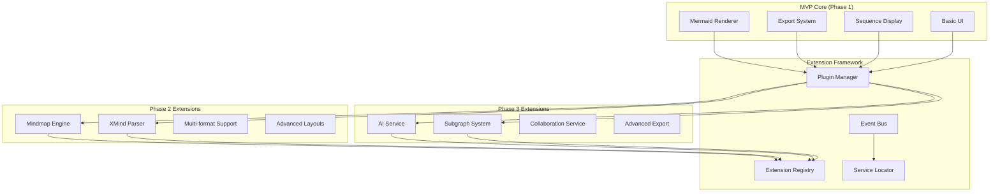

# Phase 2/3 功能擴展接口設計

本文件詳細說明 Mermaid-Render 平台為未來功能預留的擴展接口，包含心智圖支援、XMind 整合、AI 功能、子圖表系統等 Phase 2/3 功能的完整架構設計。

## 擴展架構概覽

### 擴展策略

- **向後相容**：新功能不影響現有 MVP 功能
- **模組化設計**：各功能模組獨立開發和部署
- **統一接口**：保持一致的 API 和使用者體驗
- **段階式啟用**：功能可選擇性啟用

### 整體擴展架構



## 擴展框架核心

### Plugin Manager 設計

```typescript
// 插件管理器接口
export interface PluginManager {
  // 插件生命週期
  registerPlugin(plugin: Plugin): Promise<void>
  unregisterPlugin(pluginId: string): Promise<void>
  enablePlugin(pluginId: string): Promise<void>
  disablePlugin(pluginId: string): Promise<void>

  // 插件查詢
  getPlugin(pluginId: string): Plugin | null
  getPluginsByType(type: PluginType): Plugin[]
  getActivePlugins(): Plugin[]

  // 依賴管理
  resolveDependencies(plugin: Plugin): Promise<Plugin[]>
  checkCompatibility(plugin: Plugin): Promise<CompatibilityResult>

  // 事件處理
  on(event: PluginEvent, handler: PluginEventHandler): void
  off(event: PluginEvent, handler: PluginEventHandler): void
  emit(event: PluginEvent, data: any): void
}

// 插件基礎接口
export interface Plugin {
  // 基本資訊
  readonly id: string
  readonly name: string
  readonly version: string
  readonly description: string
  readonly author: string
  readonly type: PluginType

  // 相容性資訊
  readonly minCoreVersion: string
  readonly maxCoreVersion?: string
  readonly dependencies: PluginDependency[]
  readonly capabilities: PluginCapability[]

  // 生命週期方法
  initialize(context: PluginContext): Promise<void>
  activate(): Promise<void>
  deactivate(): Promise<void>
  destroy(): Promise<void>

  // 配置介面
  getConfig(): PluginConfig
  setConfig(config: PluginConfig): Promise<void>
  validateConfig(config: PluginConfig): ValidationResult

  // 擴展點
  getExtensionPoints(): ExtensionPoint[]
  contributeToExtensionPoint(pointId: string, contribution: any): void
}

// 插件類型定義
export enum PluginType {
  RENDER_ENGINE = 'render_engine',
  EXPORT_FORMAT = 'export_format',
  LAYOUT_ALGORITHM = 'layout_algorithm',
  DATA_PARSER = 'data_parser',
  UI_COMPONENT = 'ui_component',
  AI_SERVICE = 'ai_service',
  COLLABORATION = 'collaboration',
  INTEGRATION = 'integration',
}

// 插件管理器實現
export class CorePluginManager implements PluginManager {
  private plugins: Map<string, Plugin> = new Map()
  private activePlugins: Set<string> = new Set()
  private dependencyGraph: DependencyGraph
  private eventBus: EventBus
  private serviceLocator: ServiceLocator

  constructor() {
    this.dependencyGraph = new DependencyGraph()
    this.eventBus = new EventBus()
    this.serviceLocator = new ServiceLocator()
  }

  async registerPlugin(plugin: Plugin): Promise<void> {
    // 驗證插件
    const validationResult = await this.validatePlugin(plugin)
    if (!validationResult.isValid) {
      throw new Error(
        `Plugin validation failed: ${validationResult.errors.join(', ')}`
      )
    }

    // 檢查相容性
    const compatibilityResult = await this.checkCompatibility(plugin)
    if (!compatibilityResult.isCompatible) {
      throw new Error(
        `Plugin incompatible: ${compatibilityResult.issues.join(', ')}`
      )
    }

    // 解析依賴
    const dependencies = await this.resolveDependencies(plugin)
    for (const dep of dependencies) {
      if (!this.plugins.has(dep.id)) {
        await this.registerPlugin(dep)
      }
    }

    // 註冊插件
    this.plugins.set(plugin.id, plugin)
    this.dependencyGraph.addNode(
      plugin.id,
      dependencies.map(d => d.id)
    )

    // 初始化插件
    const context = this.createPluginContext(plugin)
    await plugin.initialize(context)

    // 註冊服務
    this.registerPluginServices(plugin)

    this.emit('pluginRegistered', { pluginId: plugin.id })
  }

  async enablePlugin(pluginId: string): Promise<void> {
    const plugin = this.plugins.get(pluginId)
    if (!plugin) {
      throw new Error(`Plugin not found: ${pluginId}`)
    }

    if (this.activePlugins.has(pluginId)) {
      return // 已啟用
    }

    // 啟用依賴項
    const dependencies = this.dependencyGraph.getDependencies(pluginId)
    for (const depId of dependencies) {
      await this.enablePlugin(depId)
    }

    // 啟用插件
    await plugin.activate()
    this.activePlugins.add(pluginId)

    this.emit('pluginEnabled', { pluginId })
  }

  private createPluginContext(plugin: Plugin): PluginContext {
    return {
      pluginId: plugin.id,
      coreVersion: this.getCoreVersion(),
      serviceLocator: this.serviceLocator,
      eventBus: this.eventBus,
      logger: this.createPluginLogger(plugin.id),
      storage: this.createPluginStorage(plugin.id),
      api: this.createPluginAPI(plugin),
    }
  }
}
```

## Phase 2 功能接口

### 心智圖引擎接口

```typescript
// 心智圖引擎插件接口
export interface MindmapEngine extends Plugin {
  type: PluginType.RENDER_ENGINE

  // 心智圖特有功能
  convertFromMermaid(mermaidGraph: GraphData): Promise<MindmapData>
  convertToMermaid(mindmapData: MindmapData): Promise<string>

  // 渲染功能
  renderMindmap(
    mindmapData: MindmapData,
    container: HTMLElement,
    options?: MindmapRenderOptions
  ): Promise<MindmapRenderResult>

  // 佈局算法
  applyRadialLayout(
    center: NodeId,
    options?: RadialLayoutOptions
  ): Promise<void>
  applyTreeLayout(
    direction: TreeDirection,
    options?: TreeLayoutOptions
  ): Promise<void>
  applyFreeformLayout(options?: FreeformLayoutOptions): Promise<void>

  // 互動功能
  expandNode(nodeId: NodeId): Promise<void>
  collapseNode(nodeId: NodeId): Promise<void>
  toggleNode(nodeId: NodeId): Promise<void>

  // 編輯功能
  addChildNode(parentId: NodeId, nodeData: MindmapNodeData): Promise<NodeId>
  updateNode(nodeId: NodeId, updates: Partial<MindmapNodeData>): Promise<void>
  deleteNode(nodeId: NodeId): Promise<void>
  moveNode(nodeId: NodeId, newParentId: NodeId): Promise<void>

  // 樣式管理
  applyTheme(theme: MindmapTheme): Promise<void>
  setNodeStyle(nodeId: NodeId, style: MindmapNodeStyle): Promise<void>
  setEdgeStyle(edgeId: EdgeId, style: MindmapEdgeStyle): Promise<void>
}

// 心智圖數據模型
export interface MindmapData {
  id: string
  title: string
  rootNode: MindmapNode
  theme?: MindmapTheme
  metadata: MindmapMetadata

  // 視圖狀態
  viewState: {
    center: Point
    zoom: number
    expandedNodes: Set<string>
  }

  // 版本資訊
  version: string
  lastModified: Date
}

export interface MindmapNode {
  id: string
  text: string
  children: MindmapNode[]

  // 位置和大小
  position?: Point
  size?: Size

  // 視覺屬性
  shape?: NodeShape
  color?: string
  backgroundColor?: string
  fontSize?: number
  fontWeight?: string

  // 狀態
  expanded: boolean
  selected: boolean

  // 附加數據
  notes?: string
  links?: MindmapLink[]
  attachments?: MindmapAttachment[]

  // 自定義屬性
  properties?: Record<string, any>
}

// 心智圖引擎實現範例
export class RadialMindmapEngine implements MindmapEngine {
  public readonly id = 'radial-mindmap-engine'
  public readonly name = 'Radial Mindmap Engine'
  public readonly version = '1.0.0'
  public readonly type = PluginType.RENDER_ENGINE
  public readonly capabilities = [
    'radial-layout',
    'tree-layout',
    'interactive-editing',
    'theme-support',
  ]

  private container: HTMLElement | null = null
  private svg: d3.Selection<SVGSVGElement, unknown, null, undefined> | null =
    null
  private simulation: d3.Simulation<MindmapNode, MindmapLink> | null = null

  async initialize(context: PluginContext): Promise<void> {
    // 註冊事件監聽器
    context.eventBus.on('mindmap:nodeClick', this.handleNodeClick.bind(this))
    context.eventBus.on(
      'mindmap:nodeDoubleClick',
      this.handleNodeDoubleClick.bind(this)
    )
  }

  async activate(): Promise<void> {
    // 註冊命令
    this.registerCommands()

    // 初始化 D3 力導向模擬
    this.initializeSimulation()
  }

  async renderMindmap(
    mindmapData: MindmapData,
    container: HTMLElement,
    options: MindmapRenderOptions = {}
  ): Promise<MindmapRenderResult> {
    this.container = container

    // 建立 SVG 容器
    this.svg = d3
      .select(container)
      .append('svg')
      .attr('width', options.width || container.clientWidth)
      .attr('height', options.height || container.clientHeight)

    // 轉換數據格式
    const { nodes, links } = this.flattenMindmapData(mindmapData)

    // 應用佈局
    await this.applyRadialLayout(mindmapData.rootNode.id, options.layoutOptions)

    // 渲染節點和連線
    this.renderNodes(nodes)
    this.renderLinks(links)

    // 啟用互動
    this.enableInteractions()

    return {
      success: true,
      nodeCount: nodes.length,
      linkCount: links.length,
      renderTime: Date.now(),
    }
  }

  async applyRadialLayout(
    center: NodeId,
    options: RadialLayoutOptions = {}
  ): Promise<void> {
    if (!this.simulation) return

    const centerNode = this.findNodeById(center)
    if (!centerNode) return

    // 設定中心節點位置
    centerNode.fx = options.centerX || 0
    centerNode.fy = options.centerY || 0

    // 配置力導向模擬
    this.simulation
      .force(
        'link',
        d3.forceLink().id(d => (d as MindmapNode).id)
      )
      .force(
        'charge',
        d3.forceManyBody().strength(options.repulsionStrength || -300)
      )
      .force('center', d3.forceCenter(centerNode.fx, centerNode.fy))
      .force(
        'radial',
        d3.forceRadial(options.radius || 100, centerNode.fx, centerNode.fy)
      )

    // 重新啟動模擬
    this.simulation.alpha(1).restart()
  }

  private initializeSimulation(): void {
    this.simulation = d3
      .forceSimulation<MindmapNode, MindmapLink>()
      .force(
        'link',
        d3.forceLink<MindmapNode, MindmapLink>().id(d => d.id)
      )
      .force('charge', d3.forceManyBody())
      .force('center', d3.forceCenter(0, 0))

    this.simulation.on('tick', () => {
      this.updateVisualization()
    })
  }

  private handleNodeClick(nodeId: string): void {
    // 處理節點點擊事件
    this.selectNode(nodeId)
  }

  private handleNodeDoubleClick(nodeId: string): void {
    // 處理節點雙擊事件 - 展開/收縮
    this.toggleNode(nodeId)
  }
}
```

### XMind 解析器接口

```typescript
// XMind 解析器插件接口
export interface XMindParser extends Plugin {
  type: PluginType.DATA_PARSER

  // 檔案解析
  parseXMindFile(file: File): Promise<XMindParseResult>
  parseXMindBuffer(buffer: ArrayBuffer): Promise<XMindParseResult>
  parseXMindURL(url: string): Promise<XMindParseResult>

  // 格式轉換
  convertToMindmapData(xmindData: XMindData): Promise<MindmapData>
  convertFromMindmapData(mindmapData: MindmapData): Promise<XMindData>
  convertToMermaid(xmindData: XMindData): Promise<string>

  // 同步功能
  syncChanges(
    xmindData: XMindData,
    changes: MindmapChange[]
  ): Promise<XMindData>

  // 匯出功能
  exportToXMind(mindmapData: MindmapData): Promise<Blob>
  exportToXMindString(mindmapData: MindmapData): Promise<string>

  // 驗證功能
  validateXMindData(data: any): ValidationResult
  getSupportedVersions(): string[]
}

// XMind 數據結構
export interface XMindData {
  version: string
  workbook: XMindWorkbook
  metadata: XMindMetadata

  // 樣式資訊
  styles: XMindStyleSheet

  // 擴展資訊
  extensions?: Record<string, any>
}

export interface XMindWorkbook {
  id: string
  sheets: XMindSheet[]
  markerSheet?: XMindMarkerSheet
}

export interface XMindSheet {
  id: string
  title: string
  rootTopic: XMindTopic
  theme?: string

  // 關聯資訊
  relationships?: XMindRelationship[]
  boundaries?: XMindBoundary[]
  summaries?: XMindSummary[]
}

export interface XMindTopic {
  id: string
  title: string
  children?: {
    attached?: XMindTopic[]
    detached?: XMindTopic[]
  }

  // 標記和樣式
  markers?: XMindMarker[]
  styleId?: string

  // 位置資訊
  position?: Point

  // 附加資訊
  notes?: string
  hyperlink?: string
  labels?: string[]

  // 自定義屬性
  extensions?: Record<string, any>
}

// XMind 解析器實現
export class StandardXMindParser implements XMindParser {
  public readonly id = 'standard-xmind-parser'
  public readonly name = 'Standard XMind Parser'
  public readonly version = '1.0.0'
  public readonly type = PluginType.DATA_PARSER

  private supportedVersions = ['1.0', '2.0', '3.0', '2020', '2021', '2022']

  async parseXMindFile(file: File): Promise<XMindParseResult> {
    try {
      // XMind 檔案是 ZIP 壓縮格式
      const zip = new JSZip()
      const zipData = await zip.loadAsync(file)

      // 讀取主要內容檔案
      const contentXml = await zipData.file('content.xml')?.async('text')
      if (!contentXml) {
        throw new Error('Invalid XMind file: content.xml not found')
      }

      // 解析 XML 內容
      const parser = new DOMParser()
      const xmlDoc = parser.parseFromString(contentXml, 'application/xml')

      // 讀取樣式檔案
      const stylesXml = await zipData.file('styles.xml')?.async('text')
      const styles = stylesXml ? this.parseStyles(stylesXml) : {}

      // 讀取元數據
      const metaXml = await zipData.file('META-INF/manifest.xml')?.async('text')
      const metadata = metaXml ? this.parseMetadata(metaXml) : {}

      // 轉換為標準數據結構
      const xmindData = this.convertXmlToXMindData(xmlDoc, styles, metadata)

      return {
        success: true,
        data: xmindData,
        version: this.detectVersion(xmlDoc),
        warnings: [],
      }
    } catch (error) {
      return {
        success: false,
        error: error.message,
        warnings: [],
      }
    }
  }

  async convertToMindmapData(xmindData: XMindData): Promise<MindmapData> {
    const sheet = xmindData.workbook.sheets[0] // 使用第一個工作表
    if (!sheet) {
      throw new Error('No sheets found in XMind data')
    }

    // 轉換根節點
    const rootNode = this.convertXMindTopicToMindmapNode(
      sheet.rootTopic,
      xmindData
    )

    return {
      id: sheet.id,
      title: sheet.title,
      rootNode,
      theme: this.convertXMindTheme(sheet.theme, xmindData.styles),
      metadata: {
        source: 'xmind',
        originalVersion: xmindData.version,
        convertedAt: new Date(),
      },
      viewState: {
        center: { x: 0, y: 0 },
        zoom: 1,
        expandedNodes: new Set([rootNode.id]),
      },
      version: '1.0.0',
      lastModified: new Date(),
    }
  }

  private convertXMindTopicToMindmapNode(
    topic: XMindTopic,
    xmindData: XMindData
  ): MindmapNode {
    const node: MindmapNode = {
      id: topic.id,
      text: topic.title,
      children: [],
      expanded: true,
      selected: false,
      position: topic.position,
      notes: topic.notes,
    }

    // 轉換子節點
    if (topic.children?.attached) {
      node.children = topic.children.attached.map(child =>
        this.convertXMindTopicToMindmapNode(child, xmindData)
      )
    }

    // 應用樣式
    if (topic.styleId) {
      const style = xmindData.styles.topics?.[topic.styleId]
      if (style) {
        Object.assign(node, this.convertXMindStyle(style))
      }
    }

    // 處理標記
    if (topic.markers) {
      node.properties = {
        ...node.properties,
        markers: topic.markers,
      }
    }

    return node
  }

  async exportToXMind(mindmapData: MindmapData): Promise<Blob> {
    const xmindData = await this.convertFromMindmapData(mindmapData)

    // 建立 ZIP 結構
    const zip = new JSZip()

    // 生成 content.xml
    const contentXml = this.generateContentXml(xmindData)
    zip.file('content.xml', contentXml)

    // 生成 styles.xml
    if (xmindData.styles && Object.keys(xmindData.styles).length > 0) {
      const stylesXml = this.generateStylesXml(xmindData.styles)
      zip.file('styles.xml', stylesXml)
    }

    // 生成 manifest.xml
    const manifestXml = this.generateManifestXml()
    zip.file('META-INF/manifest.xml', manifestXml)

    // 產生 ZIP 檔案
    return zip.generateAsync({ type: 'blob' })
  }
}
```

## Phase 3 功能接口

### AI 服務接口

```typescript
// AI 服務插件接口
export interface AIService extends Plugin {
  type: PluginType.AI_SERVICE

  // 自然語言轉圖表
  generateMermaidFromText(
    description: string,
    context?: GenerationContext
  ): Promise<GenerationResult>

  generateMindmapFromText(
    description: string,
    context?: GenerationContext
  ): Promise<MindmapGenerationResult>

  // 圖表智能優化
  optimizeLayout(
    graphData: GraphData,
    preferences?: OptimizationPreferences
  ): Promise<OptimizationResult>

  suggestImprovements(graphData: GraphData): Promise<ImprovementSuggestion[]>

  // 內容擴展
  expandGraph(
    graphData: GraphData,
    expandOptions: ExpandOptions
  ): Promise<ExpansionResult>

  generateMissingNodes(
    graphData: GraphData,
    context?: GenerationContext
  ): Promise<NodeSuggestion[]>

  // 智能標籤
  generateLabels(
    nodes: GraphNode[],
    context?: LabelContext
  ): Promise<LabelSuggestion[]>

  improveLabels(graphData: GraphData): Promise<LabelImprovementResult>

  // 語言支援
  translateGraph(
    graphData: GraphData,
    targetLanguage: string
  ): Promise<TranslationResult>

  // 總結和分析
  summarizeGraph(graphData: GraphData): Promise<GraphSummary>
  analyzeComplexity(graphData: GraphData): Promise<ComplexityAnalysis>
}

// 生成上下文
export interface GenerationContext {
  domain?: string // 'software', 'business', 'education', etc.
  style?: string // 'formal', 'casual', 'technical', etc.
  language?: string
  existingNodes?: string[]
  constraints?: GenerationConstraints
}

export interface GenerationConstraints {
  maxNodes?: number
  maxDepth?: number
  requiredElements?: string[]
  forbiddenElements?: string[]
  layoutPreferences?: LayoutPreferences
}

// AI 服務實現
export class OpenAIGraphService implements AIService {
  public readonly id = 'openai-graph-service'
  public readonly name = 'OpenAI Graph Generation Service'
  public readonly version = '1.0.0'
  public readonly type = PluginType.AI_SERVICE

  private openai: OpenAI
  private promptTemplates: PromptTemplateManager
  private resultCache: LRUCache<string, any>

  constructor() {
    this.promptTemplates = new PromptTemplateManager()
    this.resultCache = new LRUCache({ max: 100, ttl: 1000 * 60 * 30 }) // 30 min cache
  }

  async initialize(context: PluginContext): Promise<void> {
    const config = context.storage.get('config') || {}

    if (!config.apiKey) {
      throw new Error('OpenAI API key not configured')
    }

    this.openai = new OpenAI({
      apiKey: config.apiKey,
      dangerouslyAllowBrowser: true, // 僅用於示例
    })
  }

  async generateMermaidFromText(
    description: string,
    context: GenerationContext = {}
  ): Promise<GenerationResult> {
    try {
      // 檢查快取
      const cacheKey = this.generateCacheKey(description, context)
      const cached = this.resultCache.get(cacheKey)
      if (cached) {
        return cached
      }

      // 準備提示詞
      const prompt = await this.promptTemplates.buildPrompt(
        'mermaid-generation',
        {
          description,
          domain: context.domain || 'general',
          style: context.style || 'technical',
          constraints: context.constraints,
        }
      )

      // 調用 OpenAI API
      const response = await this.openai.chat.completions.create({
        model: 'gpt-4',
        messages: [
          {
            role: 'system',
            content:
              'You are an expert in creating Mermaid diagrams. Generate accurate, well-structured Mermaid syntax based on the user description.',
          },
          {
            role: 'user',
            content: prompt,
          },
        ],
        temperature: 0.7,
        max_tokens: 2000,
      })

      const generatedCode = response.choices[0]?.message?.content
      if (!generatedCode) {
        throw new Error('No content generated')
      }

      // 解析和驗證生成的程式碼
      const mermaidCode = this.extractMermaidCode(generatedCode)
      const validation = await this.validateMermaidCode(mermaidCode)

      const result: GenerationResult = {
        success: true,
        code: mermaidCode,
        explanation: this.extractExplanation(generatedCode),
        confidence: this.calculateConfidence(response),
        suggestions: this.generateSuggestions(mermaidCode, context),
        validation,
        metadata: {
          model: response.model,
          tokensUsed: response.usage?.total_tokens,
          generatedAt: new Date(),
        },
      }

      // 快取結果
      this.resultCache.set(cacheKey, result)

      return result
    } catch (error) {
      return {
        success: false,
        error: error.message,
        code: '',
        confidence: 0,
      }
    }
  }

  async optimizeLayout(
    graphData: GraphData,
    preferences: OptimizationPreferences = {}
  ): Promise<OptimizationResult> {
    const prompt = await this.promptTemplates.buildPrompt(
      'layout-optimization',
      {
        graphData: this.serializeGraphData(graphData),
        preferences,
        currentIssues: await this.analyzeLayoutIssues(graphData),
      }
    )

    const response = await this.openai.chat.completions.create({
      model: 'gpt-4',
      messages: [
        {
          role: 'system',
          content:
            'You are an expert in graph layout optimization. Analyze the given graph and suggest specific improvements.',
        },
        {
          role: 'user',
          content: prompt,
        },
      ],
      temperature: 0.3,
    })

    const suggestions = this.parseOptimizationSuggestions(
      response.choices[0]?.message?.content || ''
    )

    return {
      success: true,
      suggestions,
      estimatedImprovement: this.estimateImprovement(suggestions),
      appliedOptimizations: [],
    }
  }

  async expandGraph(
    graphData: GraphData,
    expandOptions: ExpandOptions
  ): Promise<ExpansionResult> {
    const context = {
      existingNodes: graphData.nodes.map(n => n.label),
      domain: expandOptions.domain,
      expansionType: expandOptions.type, // 'breadth', 'depth', 'related'
      maxNewNodes: expandOptions.maxNewNodes || 5,
    }

    const prompt = await this.promptTemplates.buildPrompt('graph-expansion', {
      graphData: this.serializeGraphData(graphData),
      ...context,
    })

    const response = await this.openai.chat.completions.create({
      model: 'gpt-4',
      messages: [
        {
          role: 'system',
          content:
            'You are helping expand a knowledge graph by suggesting relevant new nodes and connections.',
        },
        {
          role: 'user',
          content: prompt,
        },
      ],
      temperature: 0.6,
    })

    const expansionData = this.parseExpansionData(
      response.choices[0]?.message?.content || ''
    )

    return {
      success: true,
      newNodes: expansionData.nodes,
      newEdges: expansionData.edges,
      reasoning: expansionData.reasoning,
      confidence: this.calculateConfidence(response),
    }
  }
}
```

### 子圖表系統接口

```typescript
// 子圖表系統插件接口
export interface SubgraphSystem extends Plugin {
  type: PluginType.UI_COMPONENT

  // 子圖表管理
  createSubgraph(
    parentNodeId: NodeId,
    subgraphData: GraphData
  ): Promise<SubgraphId>

  getSubgraph(subgraphId: SubgraphId): Promise<GraphData | null>
  updateSubgraph(subgraphId: SubgraphId, updates: GraphData): Promise<void>
  deleteSubgraph(subgraphId: SubgraphId): Promise<void>

  // 層次導航
  navigateToSubgraph(subgraphId: SubgraphId): Promise<NavigationResult>
  navigateUp(): Promise<NavigationResult>
  navigateToRoot(): Promise<NavigationResult>

  // 麵包屑導航
  getBreadcrumbs(): NavigationPath[]
  navigateToBreadcrumb(pathIndex: number): Promise<NavigationResult>

  // 跨圖表關聯
  createCrossGraphLink(
    sourceGraph: SubgraphId,
    sourceNode: NodeId,
    targetGraph: SubgraphId,
    targetNode: NodeId,
    linkType?: CrossLinkType
  ): Promise<CrossLinkId>

  getCrossLinks(nodeId: NodeId): Promise<CrossLink[]>
  followCrossLink(linkId: CrossLinkId): Promise<NavigationResult>

  // 搜索功能
  searchAcrossGraphs(query: string): Promise<SearchResult[]>
  findNode(nodeId: NodeId): Promise<NodeLocation | null>

  // 視圖管理
  createGraphView(
    graphId: SubgraphId,
    viewConfig: GraphViewConfig
  ): Promise<GraphViewId>

  switchView(viewId: GraphViewId): Promise<void>
  updateView(
    viewId: GraphViewId,
    updates: Partial<GraphViewConfig>
  ): Promise<void>
}

// 子圖表數據結構
export interface SubgraphData {
  id: SubgraphId
  parentNodeId?: NodeId
  parentGraphId?: SubgraphId

  // 圖表內容
  graphData: GraphData

  // 元數據
  title: string
  description?: string
  tags?: string[]

  // 導航資訊
  breadcrumbs: NavigationPath[]

  // 視圖配置
  defaultView: GraphViewConfig
  availableViews: GraphViewConfig[]

  // 權限設定
  permissions: SubgraphPermissions

  // 時間戳
  createdAt: Date
  updatedAt: Date
  lastAccessedAt: Date
}

export interface NavigationPath {
  id: SubgraphId
  title: string
  nodeId?: NodeId // 如果是通過節點進入的
  level: number
}

export interface CrossLink {
  id: CrossLinkId
  type: CrossLinkType

  // 來源資訊
  sourceGraph: SubgraphId
  sourceNode: NodeId

  // 目標資訊
  targetGraph: SubgraphId
  targetNode: NodeId

  // 顯示資訊
  label?: string
  description?: string

  // 視覺樣式
  style?: CrossLinkStyle

  // 元數據
  createdAt: Date
  createdBy?: string
}

// 子圖表系統實現
export class HierarchicalSubgraphSystem implements SubgraphSystem {
  public readonly id = 'hierarchical-subgraph-system'
  public readonly name = 'Hierarchical Subgraph System'
  public readonly version = '1.0.0'
  public readonly type = PluginType.UI_COMPONENT

  private subgraphs: Map<SubgraphId, SubgraphData> = new Map()
  private crossLinks: Map<CrossLinkId, CrossLink> = new Map()
  private currentGraph: SubgraphId | null = null
  private navigationHistory: NavigationHistoryEntry[] = []
  private eventBus: EventBus

  async initialize(context: PluginContext): Promise<void> {
    this.eventBus = context.eventBus

    // 監聽節點雙擊事件
    this.eventBus.on('node:doubleClick', this.handleNodeDoubleClick.bind(this))

    // 監聽導航事件
    this.eventBus.on('navigation:back', this.navigateBack.bind(this))
    this.eventBus.on('navigation:forward', this.navigateForward.bind(this))
  }

  async createSubgraph(
    parentNodeId: NodeId,
    subgraphData: GraphData
  ): Promise<SubgraphId> {
    const subgraphId = this.generateSubgraphId()

    // 建立子圖表數據
    const subgraph: SubgraphData = {
      id: subgraphId,
      parentNodeId,
      parentGraphId: this.currentGraph,
      graphData: subgraphData,
      title: subgraphData.metadata?.title || `Subgraph of ${parentNodeId}`,
      breadcrumbs: this.calculateBreadcrumbs(parentNodeId),
      defaultView: {
        id: 'default',
        name: 'Default View',
        layout: 'dagre',
        zoom: 1,
        center: { x: 0, y: 0 },
      },
      availableViews: [],
      permissions: {
        canView: true,
        canEdit: true,
        canDelete: true,
        canCreateSubgraphs: true,
      },
      createdAt: new Date(),
      updatedAt: new Date(),
      lastAccessedAt: new Date(),
    }

    // 儲存子圖表
    this.subgraphs.set(subgraphId, subgraph)

    // 更新父節點資訊
    await this.linkNodeToSubgraph(parentNodeId, subgraphId)

    // 發送事件
    this.eventBus.emit('subgraph:created', {
      subgraphId,
      parentNodeId,
      parentGraphId: this.currentGraph,
    })

    return subgraphId
  }

  async navigateToSubgraph(subgraphId: SubgraphId): Promise<NavigationResult> {
    const subgraph = this.subgraphs.get(subgraphId)
    if (!subgraph) {
      throw new Error(`Subgraph not found: ${subgraphId}`)
    }

    // 記錄導航歷史
    if (this.currentGraph) {
      this.navigationHistory.push({
        graphId: this.currentGraph,
        timestamp: Date.now(),
        viewport: await this.getCurrentViewport(),
      })
    }

    // 切換到子圖表
    const previousGraph = this.currentGraph
    this.currentGraph = subgraphId

    // 更新存取時間
    subgraph.lastAccessedAt = new Date()

    // 發送導航事件
    this.eventBus.emit('navigation:changed', {
      from: previousGraph,
      to: subgraphId,
      breadcrumbs: subgraph.breadcrumbs,
    })

    return {
      success: true,
      graphId: subgraphId,
      graphData: subgraph.graphData,
      breadcrumbs: subgraph.breadcrumbs,
      availableViews: subgraph.availableViews,
    }
  }

  async createCrossGraphLink(
    sourceGraph: SubgraphId,
    sourceNode: NodeId,
    targetGraph: SubgraphId,
    targetNode: NodeId,
    linkType: CrossLinkType = 'reference'
  ): Promise<CrossLinkId> {
    const linkId = this.generateCrossLinkId()

    const crossLink: CrossLink = {
      id: linkId,
      type: linkType,
      sourceGraph,
      sourceNode,
      targetGraph,
      targetNode,
      label: this.generateCrossLinkLabel(linkType, sourceNode, targetNode),
      createdAt: new Date(),
    }

    // 儲存跨圖表連結
    this.crossLinks.set(linkId, crossLink)

    // 在視覺上標記節點有跨圖表連結
    await this.markNodeWithCrossLink(sourceNode, linkId)

    // 發送事件
    this.eventBus.emit('crosslink:created', {
      linkId,
      sourceGraph,
      sourceNode,
      targetGraph,
      targetNode,
    })

    return linkId
  }

  async searchAcrossGraphs(query: string): Promise<SearchResult[]> {
    const results: SearchResult[] = []

    for (const [graphId, subgraph] of this.subgraphs) {
      // 搜索節點
      for (const node of subgraph.graphData.nodes) {
        if (
          this.matchesQuery(node.label, query) ||
          this.matchesQuery(node.data?.description, query)
        ) {
          results.push({
            type: 'node',
            graphId,
            nodeId: node.id,
            label: node.label,
            breadcrumbs: subgraph.breadcrumbs,
            relevanceScore: this.calculateRelevance(node.label, query),
          })
        }
      }

      // 搜索圖表標題和描述
      if (
        this.matchesQuery(subgraph.title, query) ||
        this.matchesQuery(subgraph.description, query)
      ) {
        results.push({
          type: 'graph',
          graphId,
          label: subgraph.title,
          description: subgraph.description,
          breadcrumbs: subgraph.breadcrumbs,
          relevanceScore: this.calculateRelevance(subgraph.title, query),
        })
      }
    }

    // 按相關度排序
    results.sort((a, b) => b.relevanceScore - a.relevanceScore)

    return results
  }

  private async handleNodeDoubleClick(event: NodeClickEvent): Promise<void> {
    const nodeId = event.nodeId

    // 檢查節點是否有子圖表
    const hasSubgraph = await this.nodeHasSubgraph(nodeId)

    if (hasSubgraph) {
      const subgraphId = await this.getNodeSubgraphId(nodeId)
      if (subgraphId) {
        await this.navigateToSubgraph(subgraphId)
      }
    } else {
      // 提供建立子圖表的選項
      this.eventBus.emit('subgraph:createPrompt', {
        nodeId,
        suggestedContent: await this.generateSubgraphSuggestions(nodeId),
      })
    }
  }
}
```

## 協作功能接口

### 即時協作服務

```typescript
// 協作服務插件接口
export interface CollaborationService extends Plugin {
  type: PluginType.COLLABORATION

  // 會話管理
  createSession(projectId: string): Promise<SessionId>
  joinSession(sessionId: SessionId, user: CollaborationUser): Promise<void>
  leaveSession(sessionId: SessionId, userId: string): Promise<void>

  // 即時同步
  broadcastOperation(sessionId: SessionId, operation: Operation): Promise<void>
  subscribeToOperations(
    sessionId: SessionId,
    callback: OperationCallback
  ): Promise<SubscriptionId>

  // 衝突解決
  resolveConflict(conflict: OperationConflict): Promise<Resolution>

  // 變更追蹤
  trackChange(change: Change): Promise<void>
  getChangeHistory(
    projectId: string,
    options?: HistoryOptions
  ): Promise<Change[]>

  // 權限管理
  setUserPermissions(
    sessionId: SessionId,
    userId: string,
    permissions: UserPermissions
  ): Promise<void>

  // 游標同步
  broadcastCursor(sessionId: SessionId, cursor: CursorPosition): Promise<void>
  subscribeToCursors(
    sessionId: SessionId,
    callback: CursorCallback
  ): Promise<void>

  // 語音/視訊 (可選)
  startVoiceCall?(sessionId: SessionId): Promise<CallId>
  startVideoCall?(sessionId: SessionId): Promise<CallId>
}

// 操作類型定義
export interface Operation {
  id: string
  type: OperationType
  userId: string
  timestamp: number
  data: any

  // 操作變換相關
  transform?: (other: Operation) => Operation
  apply?: (state: GraphData) => GraphData
  invert?: () => Operation
}

export enum OperationType {
  NODE_CREATE = 'node_create',
  NODE_UPDATE = 'node_update',
  NODE_DELETE = 'node_delete',
  NODE_MOVE = 'node_move',

  EDGE_CREATE = 'edge_create',
  EDGE_UPDATE = 'edge_update',
  EDGE_DELETE = 'edge_delete',

  LAYOUT_CHANGE = 'layout_change',
  STYLE_CHANGE = 'style_change',

  VIEWPORT_CHANGE = 'viewport_change',

  // 序列展示操作
  SEQUENCE_START = 'sequence_start',
  SEQUENCE_PAUSE = 'sequence_pause',
  SEQUENCE_STEP = 'sequence_step',
}

// 實時協作服務實現
export class WebRTCCollaborationService implements CollaborationService {
  public readonly id = 'webrtc-collaboration-service'
  public readonly name = 'WebRTC Collaboration Service'
  public readonly version = '1.0.0'
  public readonly type = PluginType.COLLABORATION

  private sessions: Map<SessionId, CollaborationSession> = new Map()
  private peerConnections: Map<string, RTCPeerConnection> = new Map()
  private operationalTransform: OperationalTransform
  private conflictResolver: ConflictResolver

  constructor() {
    this.operationalTransform = new OperationalTransform()
    this.conflictResolver = new ConflictResolver()
  }

  async createSession(projectId: string): Promise<SessionId> {
    const sessionId = this.generateSessionId()

    const session: CollaborationSession = {
      id: sessionId,
      projectId,
      participants: new Map(),
      operations: [],
      state: null,
      createdAt: Date.now(),
      lastActivity: Date.now(),
    }

    this.sessions.set(sessionId, session)

    return sessionId
  }

  async joinSession(
    sessionId: SessionId,
    user: CollaborationUser
  ): Promise<void> {
    const session = this.sessions.get(sessionId)
    if (!session) {
      throw new Error(`Session not found: ${sessionId}`)
    }

    // 建立 WebRTC 連接
    const peerConnection = await this.createPeerConnection(user.id, sessionId)

    // 加入參與者
    session.participants.set(user.id, {
      ...user,
      joinedAt: Date.now(),
      cursor: null,
      permissions: {
        canEdit: true,
        canView: true,
        canInvite: false,
        canManage: false,
      },
    })

    // 發送歡迎訊息和同步狀態
    await this.sendWelcomeMessage(sessionId, user.id)
    await this.syncState(sessionId, user.id)

    // 通知其他參與者
    await this.broadcastUserJoined(sessionId, user)
  }

  async broadcastOperation(
    sessionId: SessionId,
    operation: Operation
  ): Promise<void> {
    const session = this.sessions.get(sessionId)
    if (!session) return

    // 操作變換處理
    const transformedOperation = this.operationalTransform.transform(
      operation,
      session.operations
    )

    // 檢查衝突
    const conflicts = this.detectConflicts(
      transformedOperation,
      session.operations
    )
    if (conflicts.length > 0) {
      // 解決衝突
      for (const conflict of conflicts) {
        const resolution = await this.conflictResolver.resolve(conflict)
        transformedOperation.data = {
          ...transformedOperation.data,
          ...resolution.data,
        }
      }
    }

    // 應用到會話狀態
    if (session.state) {
      session.state = transformedOperation.apply!(session.state)
    }

    // 記錄操作
    session.operations.push(transformedOperation)
    session.lastActivity = Date.now()

    // 廣播給所有參與者（除了發送者）
    for (const [userId, participant] of session.participants) {
      if (userId !== operation.userId) {
        await this.sendOperationToUser(sessionId, userId, transformedOperation)
      }
    }
  }

  private async createPeerConnection(
    userId: string,
    sessionId: SessionId
  ): Promise<RTCPeerConnection> {
    const peerConnection = new RTCPeerConnection({
      iceServers: [{ urls: 'stun:stun.l.google.com:19302' }],
    })

    // 設定數據通道
    const dataChannel = peerConnection.createDataChannel('collaboration', {
      ordered: true,
    })

    dataChannel.onopen = () => {
      console.log(`Data channel opened for user ${userId}`)
    }

    dataChannel.onmessage = event => {
      this.handleDataChannelMessage(sessionId, userId, event.data)
    }

    // 儲存連接
    this.peerConnections.set(`${sessionId}:${userId}`, peerConnection)

    return peerConnection
  }

  private handleDataChannelMessage(
    sessionId: SessionId,
    userId: string,
    data: string
  ): void {
    try {
      const message = JSON.parse(data)

      switch (message.type) {
        case 'operation':
          this.handleRemoteOperation(sessionId, message.operation)
          break
        case 'cursor':
          this.handleCursorUpdate(sessionId, userId, message.cursor)
          break
        case 'selection':
          this.handleSelectionUpdate(sessionId, userId, message.selection)
          break
      }
    } catch (error) {
      console.error('Failed to handle data channel message:', error)
    }
  }
}
```

<function_calls>
<invoke name="TodoWrite">
<parameter name="todos">[{"content": "\u5206\u6790\u73fe\u6709\u7684 Project Brief\u3001PRD \u548c UX Spec", "status": "completed", "activeForm": "\u5206\u6790\u73fe\u6709\u6587\u4ef6"}, {"content": "\u5efa\u7acb\u6280\u8853\u67b6\u69cb\u6587\u4ef6\u57fa\u65bc PRD \u548c UX \u9700\u6c42", "status": "completed", "activeForm": "\u5efa\u7acb\u6280\u8853\u67b6\u69cb\u6587\u4ef6"}, {"content": "\u5b9a\u7fa9\u7cfb\u7d71\u67b6\u69cb\u548c\u6280\u8853\u68e7", "status": "completed", "activeForm": "\u5b9a\u7fa9\u7cfb\u7d71\u67b6\u69cb"}, {"content": "\u8a2d\u8a08\u53ef\u64f4\u5c55\u7684\u6e32\u67d3\u5f15\u64ce\u67b6\u69cb", "status": "completed", "activeForm": "\u8a2d\u8a08\u6e32\u67d4\u5f15\u64ce\u67b6\u69cb"}, {"content": "\u898f\u5283\u5e8f\u5217\u5c55\u793a\u529f\u80fd\u7684\u6280\u8853\u5be6\u73fe", "status": "completed", "activeForm": "\u898f\u5283\u5e8f\u5217\u5c55\u793a\u6280\u8853\u5be6\u73fe"}, {"content": "\u8a2d\u8a08\u9ad8\u6548\u80fd\u532f\u51fa\u7cfb\u7d71\u67b6\u69cb", "status": "completed", "activeForm": "\u8a2d\u8a08\u532f\u51fa\u7cfb\u7d71\u67b6\u69cb"}, {"content": "\u9810\u7559 Phase 2/3 \u529f\u80fd\u7684\u67b6\u69cb\u63a5\u53e3", "status": "completed", "activeForm": "\u9810\u7559\u672a\u4f86\u529f\u80fd\u63a5\u53e3"}]
