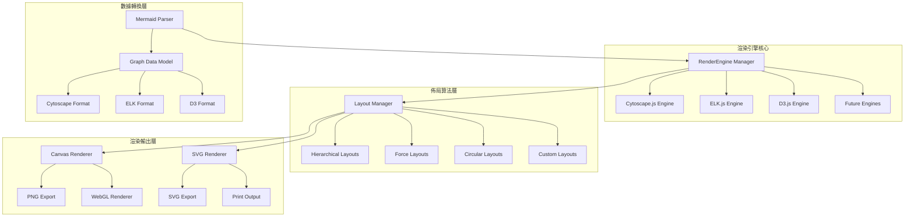

# 渲染引擎架構設計

本文件詳細說明 Mermaid-Render 平台的可擴展渲染引擎架構，支援多種佈局算法並為未來心智圖、XMind 整合等功能預留完整接口。

## 渲染引擎概覽

### 設計目標
- **模組化設計**：支援多種圖表類型和渲染引擎
- **插件式架構**：可動態載入不同的佈局算法
- **高效能渲染**：支援 1000+ 節點的複雜圖表
- **跨平台相容**：Web、Node.js 環境統一接口
- **未來擴展性**：為心智圖、AI 驅動佈局預留接口

### 核心架構



## 核心接口設計

### 渲染引擎基礎接口

```typescript
// 渲染引擎基礎接口
export interface RenderEngine {
  // 基本資訊
  readonly name: string;
  readonly version: string;
  readonly supportedTypes: GraphType[];
  readonly supportedLayouts: LayoutAlgorithm[];
  readonly capabilities: EngineCapability[];
  
  // 生命週期管理
  initialize(container: HTMLElement, options?: InitOptions): Promise<void>;
  destroy(): void;
  resize(width: number, height: number): void;
  
  // 數據處理
  setData(data: GraphData): Promise<RenderResult>;
  updateData(updates: GraphUpdate[]): Promise<RenderResult>;
  clearData(): void;
  
  // 佈局控制
  applyLayout(algorithm: LayoutAlgorithm, options?: LayoutOptions): Promise<void>;
  getAvailableLayouts(): LayoutAlgorithm[];
  getCurrentLayout(): LayoutAlgorithm | null;
  
  // 視覺控制
  setViewport(viewport: Viewport): void;
  getViewport(): Viewport;
  fit(padding?: number): void;
  center(nodeIds?: string[]): void;
  
  // 互動功能
  enableInteraction(interactions: InteractionType[]): void;
  disableInteraction(interactions: InteractionType[]): void;
  
  // 選擇與高亮
  selectElements(elementIds: string[]): void;
  highlightElements(elementIds: string[], style?: HighlightStyle): void;
  clearHighlight(): void;
  
  // 動畫支援
  animateLayout(duration: number, easing?: EasingFunction): Promise<void>;
  animateToViewport(viewport: Viewport, duration: number): Promise<void>;
  
  // 匯出功能
  export(format: ExportFormat, options?: ExportOptions): Promise<ExportResult>;
  
  // 事件系統
  on(event: RenderEvent, callback: EventCallback): void;
  off(event: RenderEvent, callback: EventCallback): void;
  emit(event: RenderEvent, data?: any): void;
  
  // 序列展示支援
  showSequence(sequence: SequenceStep[]): Promise<void>;
  pauseSequence(): void;
  resumeSequence(): void;
  stopSequence(): void;
  
  // 擴展接口（未來功能）
  installPlugin(plugin: RenderPlugin): Promise<void>;
  getPlugin(name: string): RenderPlugin | null;
}

// 圖表類型定義
export enum GraphType {
  FLOWCHART = 'flowchart',
  SEQUENCE = 'sequence',
  CLASS = 'class',
  STATE = 'state',
  GANTT = 'gantt',
  JOURNEY = 'journey',
  GITGRAPH = 'gitgraph',
  MINDMAP = 'mindmap',    // Phase 2
  TIMELINE = 'timeline',  // Phase 2
  SANKEY = 'sankey',     // Phase 3
  NETWORK = 'network'    // Phase 3
}

// 引擎能力標識
export enum EngineCapability {
  HARDWARE_ACCELERATION = 'hardware_acceleration',
  LARGE_GRAPH_SUPPORT = 'large_graph_support',
  ANIMATION_SUPPORT = 'animation_support',
  SEQUENCE_SUPPORT = 'sequence_support',
  REAL_TIME_COLLABORATION = 'real_time_collaboration',
  CUSTOM_LAYOUTS = 'custom_layouts',
  PLUGIN_SYSTEM = 'plugin_system'
}
```

### 數據模型設計

```typescript
// 統一圖表數據模型
export interface GraphData {
  // 基本資訊
  id: string;
  type: GraphType;
  version: string;
  metadata: GraphMetadata;
  
  // 圖表元素
  nodes: GraphNode[];
  edges: GraphEdge[];
  groups?: GraphGroup[];
  annotations?: GraphAnnotation[];
  
  // 佈局資訊
  layout?: LayoutInfo;
  viewport?: Viewport;
  
  // 樣式設定
  theme?: ThemeConfig;
  styles?: StyleConfig;
  
  // 序列展示數據
  sequence?: SequenceData;
  
  // 擴展數據
  extensions?: Record<string, any>;
}

// 節點數據結構
export interface GraphNode {
  id: string;
  type: NodeType;
  label: string;
  
  // 位置資訊
  position?: Point;
  size?: Size;
  
  // 視覺樣式
  shape?: NodeShape;
  style?: NodeStyle;
  
  // 數據屬性
  data?: Record<string, any>;
  
  // 階層資訊
  parent?: string;
  children?: string[];
  
  // 序列資訊
  sequenceIndex?: number;
  sequenceGroup?: string;
  
  // 互動狀態
  selected?: boolean;
  highlighted?: boolean;
  locked?: boolean;
}

// 邊線數據結構
export interface GraphEdge {
  id: string;
  source: string;
  target: string;
  
  // 標籤與類型
  label?: string;
  type?: EdgeType;
  
  // 路徑資訊
  controlPoints?: Point[];
  
  // 視覺樣式
  style?: EdgeStyle;
  
  // 數據屬性
  data?: Record<string, any>;
  
  // 序列資訊
  sequenceIndex?: number;
  sequenceGroup?: string;
  
  // 互動狀態
  selected?: boolean;
  highlighted?: boolean;
}

// 群組數據結構（支援子圖表）
export interface GraphGroup {
  id: string;
  label: string;
  nodeIds: string[];
  
  // 視覺屬性
  style?: GroupStyle;
  collapsed?: boolean;
  
  // 子圖表支援（Phase 3）
  subgraph?: GraphData;
  
  // 序列支援
  sequenceIndex?: number;
}
```

## Cytoscape.js 引擎實現

### CytoscapeEngine 核心實現

```typescript
export class CytoscapeEngine implements RenderEngine {
  public readonly name = 'cytoscape';
  public readonly version = '3.26.0';
  public readonly supportedTypes = [
    GraphType.FLOWCHART,
    GraphType.CLASS,
    GraphType.STATE,
    GraphType.NETWORK
  ];
  public readonly supportedLayouts = [
    'dagre',
    'klay',
    'cola',
    'cose',
    'circle',
    'grid',
    'random',
    'preset'
  ];
  public readonly capabilities = [
    EngineCapability.HARDWARE_ACCELERATION,
    EngineCapability.LARGE_GRAPH_SUPPORT,
    EngineCapability.ANIMATION_SUPPORT,
    EngineCapability.SEQUENCE_SUPPORT,
    EngineCapability.CUSTOM_LAYOUTS
  ];
  
  private cy: cytoscape.Core | null = null;
  private container: HTMLElement | null = null;
  private currentSequence: SequenceController | null = null;
  private layoutController: LayoutController;
  private animationController: AnimationController;
  private exportController: ExportController;
  
  constructor() {
    this.layoutController = new LayoutController(this);
    this.animationController = new AnimationController(this);
    this.exportController = new ExportController(this);
  }
  
  async initialize(container: HTMLElement, options: InitOptions = {}): Promise<void> {
    this.container = container;
    
    // 初始化 Cytoscape 實例
    this.cy = cytoscape({
      container,
      
      // 樣式設定
      style: this.getDefaultStylesheet(),
      
      // 佈局設定
      layout: { name: options.defaultLayout || 'dagre' },
      
      // 互動設定
      userZoomingEnabled: true,
      userPanningEnabled: true,
      boxSelectionEnabled: true,
      
      // 效能優化
      textureOnViewport: options.enableTextureOnViewport ?? true,
      motionBlur: options.enableMotionBlur ?? false,
      wheelSensitivity: 0.1,
      
      // 事件處理
      ready: () => {
        this.setupEventHandlers();
        this.emit('ready');
      }
    });
    
    // 載入擴展
    await this.loadExtensions(options.extensions);
    
    // 設定互動行為
    this.setupInteractions(options.interactions);
  }
  
  async setData(data: GraphData): Promise<RenderResult> {
    if (!this.cy) {
      throw new Error('Engine not initialized');
    }
    
    const startTime = performance.now();
    
    try {
      // 轉換數據格式
      const cytoscapeData = await this.convertToCytoscapeFormat(data);
      
      // 清空舊數據
      this.cy.elements().remove();
      
      // 添加新數據
      this.cy.add(cytoscapeData);
      
      // 應用樣式
      if (data.styles) {
        this.applyStyles(data.styles);
      }
      
      // 應用佈局
      if (data.layout) {
        await this.applyLayout(data.layout.algorithm, data.layout.options);
      }
      
      // 設定視口
      if (data.viewport) {
        this.setViewport(data.viewport);
      } else {
        this.fit();
      }
      
      const renderTime = performance.now() - startTime;
      
      const result: RenderResult = {
        success: true,
        renderTime,
        elementCount: this.cy.elements().length,
        nodeCount: this.cy.nodes().length,
        edgeCount: this.cy.edges().length,
        metadata: {
          engine: this.name,
          version: this.version,
          graphType: data.type
        }
      };
      
      this.emit('dataSet', result);
      return result;
      
    } catch (error) {
      const result: RenderResult = {
        success: false,
        renderTime: performance.now() - startTime,
        error: error.message,
        elementCount: 0,
        nodeCount: 0,
        edgeCount: 0
      };
      
      this.emit('error', error);
      return result;
    }
  }
  
  // 數據轉換
  private async convertToCytoscapeFormat(data: GraphData): Promise<cytoscape.ElementDefinition[]> {
    const elements: cytoscape.ElementDefinition[] = [];
    
    // 轉換節點
    for (const node of data.nodes) {
      elements.push({
        group: 'nodes',
        data: {
          id: node.id,
          label: node.label,
          type: node.type,
          ...node.data
        },
        position: node.position,
        style: this.convertNodeStyle(node.style),
        classes: this.getNodeClasses(node)
      });
    }
    
    // 轉換邊線
    for (const edge of data.edges) {
      elements.push({
        group: 'edges',
        data: {
          id: edge.id,
          source: edge.source,
          target: edge.target,
          label: edge.label,
          type: edge.type,
          ...edge.data
        },
        style: this.convertEdgeStyle(edge.style),
        classes: this.getEdgeClasses(edge)
      });
    }
    
    // 處理群組（支援複合節點）
    if (data.groups) {
      for (const group of data.groups) {
        // 建立群組父節點
        elements.push({
          group: 'nodes',
          data: {
            id: group.id,
            label: group.label,
            type: 'group'
          },
          style: this.convertGroupStyle(group.style),
          classes: 'group'
        });
        
        // 設定子節點的父子關係
        for (const nodeId of group.nodeIds) {
          const nodeElement = elements.find(el => el.data?.id === nodeId);
          if (nodeElement) {
            nodeElement.data!.parent = group.id;
          }
        }
      }
    }
    
    return elements;
  }
  
  // 佈局應用
  async applyLayout(algorithm: LayoutAlgorithm, options: LayoutOptions = {}): Promise<void> {
    if (!this.cy) return;
    
    return this.layoutController.applyLayout(algorithm, options);
  }
  
  // 序列展示實現
  async showSequence(sequence: SequenceStep[]): Promise<void> {
    if (!this.cy) return;
    
    this.currentSequence = new SequenceController(this.cy, this.animationController);
    await this.currentSequence.play(sequence);
  }
  
  // 匯出功能
  async export(format: ExportFormat, options: ExportOptions = {}): Promise<ExportResult> {
    if (!this.cy) {
      throw new Error('Engine not initialized');
    }
    
    return this.exportController.export(format, options);
  }
  
  // 事件處理設定
  private setupEventHandlers(): void {
    if (!this.cy) return;
    
    // 節點事件
    this.cy.on('tap', 'node', (event) => {
      const node = event.target;
      this.emit('nodeClick', {
        nodeId: node.id(),
        data: node.data(),
        position: event.position
      });
    });
    
    // 邊線事件
    this.cy.on('tap', 'edge', (event) => {
      const edge = event.target;
      this.emit('edgeClick', {
        edgeId: edge.id(),
        source: edge.source().id(),
        target: edge.target().id(),
        data: edge.data()
      });
    });
    
    // 視口變化事件
    this.cy.on('viewport', () => {
      this.emit('viewportChange', this.getViewport());
    });
    
    // 選擇事件
    this.cy.on('select unselect', () => {
      const selected = this.cy.$(':selected').map(el => el.id());
      this.emit('selectionChange', selected);
    });
  }
  
  // 預設樣式表
  private getDefaultStylesheet(): cytoscape.Stylesheet[] {
    return [
      // 節點樣式
      {
        selector: 'node',
        style: {
          'background-color': '#3B82F6',
          'label': 'data(label)',
          'text-valign': 'center',
          'text-halign': 'center',
          'color': '#FFFFFF',
          'font-family': 'Inter, sans-serif',
          'font-size': '12px',
          'font-weight': '500',
          'width': 'label',
          'height': 'label',
          'padding': '8px',
          'shape': 'roundrectangle',
          'border-width': '1px',
          'border-color': '#1E40AF',
          'text-wrap': 'wrap',
          'text-max-width': '120px'
        }
      },
      
      // 邊線樣式
      {
        selector: 'edge',
        style: {
          'width': 2,
          'line-color': '#64748B',
          'target-arrow-color': '#64748B',
          'target-arrow-shape': 'triangle',
          'curve-style': 'bezier',
          'arrow-scale': 1,
          'label': 'data(label)',
          'font-size': '10px',
          'color': '#475569',
          'text-background-color': '#FFFFFF',
          'text-background-opacity': 0.8,
          'text-background-padding': '2px'
        }
      },
      
      // 群組樣式
      {
        selector: '.group',
        style: {
          'background-color': '#F1F5F9',
          'background-opacity': 0.3,
          'border-width': 2,
          'border-color': '#CBD5E1',
          'border-style': 'dashed',
          'label': 'data(label)',
          'text-valign': 'top',
          'text-halign': 'center',
          'color': '#475569',
          'font-weight': 'bold',
          'padding': '10px'
        }
      },
      
      // 選中狀態
      {
        selector: ':selected',
        style: {
          'border-width': '3px',
          'border-color': '#06B6D4',
          'overlay-color': '#06B6D4',
          'overlay-opacity': 0.2,
          'overlay-padding': '4px'
        }
      },
      
      // 高亮狀態
      {
        selector: '.highlighted',
        style: {
          'background-color': '#F59E0B',
          'line-color': '#F59E0B',
          'target-arrow-color': '#F59E0B',
          'border-color': '#D97706',
          'z-index': 999
        }
      },
      
      // 序列展示狀態
      {
        selector: '.sequence-active',
        style: {
          'background-color': '#10B981',
          'border-color': '#059669',
          'border-width': '3px',
          'z-index': 1000,
          'transition-property': 'background-color, border-color',
          'transition-duration': '300ms'
        }
      },
      
      // 半透明狀態（序列展示時其他元素）
      {
        selector: '.sequence-dimmed',
        style: {
          'opacity': 0.3,
          'transition-property': 'opacity',
          'transition-duration': '300ms'
        }
      }
    ];
  }
}
```

## ELK.js 引擎實現

### ELKEngine 階層佈局特化

```typescript
export class ELKEngine implements RenderEngine {
  public readonly name = 'elk';
  public readonly version = '0.8.2';
  public readonly supportedTypes = [
    GraphType.FLOWCHART,
    GraphType.SEQUENCE,
    GraphType.CLASS
  ];
  public readonly supportedLayouts = [
    'layered',
    'stress',
    'mrtree',
    'radial',
    'force',
    'disco'
  ];
  public readonly capabilities = [
    EngineCapability.LARGE_GRAPH_SUPPORT,
    EngineCapability.CUSTOM_LAYOUTS
  ];
  
  private elk: ELK;
  private container: HTMLElement | null = null;
  private svgElement: SVGSVGElement | null = null;
  private graph: ELKNode | null = null;
  
  constructor() {
    this.elk = new ELK({
      workerUrl: '/elk-worker.js' // Web Worker for performance
    });
  }
  
  async initialize(container: HTMLElement, options: InitOptions = {}): Promise<void> {
    this.container = container;
    
    // 建立 SVG 容器
    this.svgElement = document.createElementNS('http://www.w3.org/2000/svg', 'svg');
    this.svgElement.style.width = '100%';
    this.svgElement.style.height = '100%';
    container.appendChild(this.svgElement);
    
    this.emit('ready');
  }
  
  async setData(data: GraphData): Promise<RenderResult> {
    const startTime = performance.now();
    
    try {
      // 轉換為 ELK 格式
      const elkGraph = this.convertToELKFormat(data);
      
      // 應用佈局計算
      const layoutedGraph = await this.elk.layout(elkGraph, {
        layoutOptions: this.getLayoutOptions(data.layout?.options)
      });
      
      // 渲染到 SVG
      this.renderToSVG(layoutedGraph);
      
      this.graph = layoutedGraph;
      
      const renderTime = performance.now() - startTime;
      
      return {
        success: true,
        renderTime,
        elementCount: this.countElements(layoutedGraph),
        nodeCount: this.countNodes(layoutedGraph),
        edgeCount: this.countEdges(layoutedGraph),
        metadata: {
          engine: this.name,
          version: this.version,
          graphType: data.type
        }
      };
      
    } catch (error) {
      return {
        success: false,
        renderTime: performance.now() - startTime,
        error: error.message,
        elementCount: 0,
        nodeCount: 0,
        edgeCount: 0
      };
    }
  }
  
  // ELK 格式轉換
  private convertToELKFormat(data: GraphData): ELKNode {
    const elkNode: ELKNode = {
      id: 'root',
      layoutOptions: {
        'elk.algorithm': 'layered',
        'elk.direction': 'DOWN',
        'elk.spacing.nodeNode': '20',
        'elk.layered.spacing.nodeNodeBetweenLayers': '30'
      },
      children: [],
      edges: []
    };
    
    // 轉換節點
    for (const node of data.nodes) {
      elkNode.children!.push({
        id: node.id,
        labels: node.label ? [{ text: node.label }] : [],
        width: node.size?.width || 120,
        height: node.size?.height || 40,
        layoutOptions: this.getNodeLayoutOptions(node)
      });
    }
    
    // 轉換邊線
    for (const edge of data.edges) {
      elkNode.edges!.push({
        id: edge.id,
        sources: [edge.source],
        targets: [edge.target],
        labels: edge.label ? [{ text: edge.label }] : [],
        layoutOptions: this.getEdgeLayoutOptions(edge)
      });
    }
    
    return elkNode;
  }
  
  // SVG 渲染
  private renderToSVG(graph: ELKNode): void {
    if (!this.svgElement) return;
    
    // 清空現有內容
    this.svgElement.innerHTML = '';
    
    // 設定 viewBox
    const bounds = this.calculateGraphBounds(graph);
    this.svgElement.setAttribute('viewBox', 
      `${bounds.x - 20} ${bounds.y - 20} ${bounds.width + 40} ${bounds.height + 40}`);
    
    // 建立定義區域（箭頭標記等）
    const defs = this.createSVGDefs();
    this.svgElement.appendChild(defs);
    
    // 渲染邊線（先渲染避免被節點覆蓋）
    if (graph.edges) {
      for (const edge of graph.edges) {
        const edgeElement = this.createSVGEdge(edge);
        this.svgElement.appendChild(edgeElement);
      }
    }
    
    // 渲染節點
    if (graph.children) {
      for (const node of graph.children) {
        const nodeElement = this.createSVGNode(node);
        this.svgElement.appendChild(nodeElement);
      }
    }
  }
  
  private createSVGNode(node: ELKNode): SVGGElement {
    const group = document.createElementNS('http://www.w3.org/2000/svg', 'g');
    group.setAttribute('id', `node-${node.id}`);
    group.setAttribute('class', 'node');
    
    // 節點矩形
    const rect = document.createElementNS('http://www.w3.org/2000/svg', 'rect');
    rect.setAttribute('x', node.x?.toString() || '0');
    rect.setAttribute('y', node.y?.toString() || '0');
    rect.setAttribute('width', node.width?.toString() || '0');
    rect.setAttribute('height', node.height?.toString() || '0');
    rect.setAttribute('rx', '4');
    rect.setAttribute('ry', '4');
    rect.setAttribute('fill', '#3B82F6');
    rect.setAttribute('stroke', '#1E40AF');
    rect.setAttribute('stroke-width', '1');
    
    // 節點標籤
    if (node.labels && node.labels.length > 0) {
      const text = document.createElementNS('http://www.w3.org/2000/svg', 'text');
      text.setAttribute('x', ((node.x || 0) + (node.width || 0) / 2).toString());
      text.setAttribute('y', ((node.y || 0) + (node.height || 0) / 2).toString());
      text.setAttribute('text-anchor', 'middle');
      text.setAttribute('dominant-baseline', 'central');
      text.setAttribute('fill', 'white');
      text.setAttribute('font-family', 'Inter, sans-serif');
      text.setAttribute('font-size', '12');
      text.textContent = node.labels[0].text;
      
      group.appendChild(text);
    }
    
    group.appendChild(rect);
    return group;
  }
  
  private createSVGEdge(edge: ELKEdge): SVGGElement {
    const group = document.createElementNS('http://www.w3.org/2000/svg', 'g');
    group.setAttribute('id', `edge-${edge.id}`);
    group.setAttribute('class', 'edge');
    
    // 建立路徑
    if (edge.sections && edge.sections.length > 0) {
      const section = edge.sections[0];
      let pathData = `M ${section.startPoint.x} ${section.startPoint.y}`;
      
      // 添加彎曲點
      if (section.bendPoints) {
        for (const point of section.bendPoints) {
          pathData += ` L ${point.x} ${point.y}`;
        }
      }
      
      pathData += ` L ${section.endPoint.x} ${section.endPoint.y}`;
      
      const path = document.createElementNS('http://www.w3.org/2000/svg', 'path');
      path.setAttribute('d', pathData);
      path.setAttribute('stroke', '#64748B');
      path.setAttribute('stroke-width', '2');
      path.setAttribute('fill', 'none');
      path.setAttribute('marker-end', 'url(#arrowhead)');
      
      group.appendChild(path);
    }
    
    return group;
  }
  
  private createSVGDefs(): SVGDefsElement {
    const defs = document.createElementNS('http://www.w3.org/2000/svg', 'defs');
    
    // 箭頭標記
    const marker = document.createElementNS('http://www.w3.org/2000/svg', 'marker');
    marker.setAttribute('id', 'arrowhead');
    marker.setAttribute('markerWidth', '10');
    marker.setAttribute('markerHeight', '7');
    marker.setAttribute('refX', '9');
    marker.setAttribute('refY', '3.5');
    marker.setAttribute('orient', 'auto');
    
    const polygon = document.createElementNS('http://www.w3.org/2000/svg', 'polygon');
    polygon.setAttribute('points', '0 0, 10 3.5, 0 7');
    polygon.setAttribute('fill', '#64748B');
    
    marker.appendChild(polygon);
    defs.appendChild(marker);
    
    return defs;
  }
}
```

## 佈局控制器設計

### 智能佈局選擇

```typescript
export class LayoutController {
  private engine: RenderEngine;
  private layoutRegistry: Map<string, LayoutProvider>;
  private layoutAnalyzer: LayoutAnalyzer;
  
  constructor(engine: RenderEngine) {
    this.engine = engine;
    this.layoutRegistry = new Map();
    this.layoutAnalyzer = new LayoutAnalyzer();
    this.registerDefaultLayouts();
  }
  
  // 智能佈局選擇
  async suggestOptimalLayout(data: GraphData): Promise<LayoutSuggestion> {
    const analysis = await this.layoutAnalyzer.analyze(data);
    
    // 根據圖表特性選擇最適佈局
    if (analysis.isHierarchical) {
      return {
        algorithm: 'dagre',
        reason: '階層式結構，建議使用 Dagre 佈局',
        confidence: 0.9
      };
    } else if (analysis.isCircular) {
      return {
        algorithm: 'circle',
        reason: '環形結構，建議使用圓形佈局',
        confidence: 0.8
      };
    } else if (analysis.nodeCount > 1000) {
      return {
        algorithm: 'cola',
        reason: '大型圖表，建議使用 Cola 力導向佈局',
        confidence: 0.85
      };
    } else {
      return {
        algorithm: 'cose',
        reason: '複雜網路結構，建議使用 COSE 佈局',
        confidence: 0.7
      };
    }
  }
  
  // 佈局品質評估
  async evaluateLayout(data: GraphData, layoutResult: LayoutResult): Promise<LayoutQuality> {
    const metrics = {
      edgeCrossings: this.countEdgeCrossings(layoutResult),
      nodeOverlaps: this.countNodeOverlaps(layoutResult),
      aspectRatio: this.calculateAspectRatio(layoutResult),
      symmetry: this.calculateSymmetry(layoutResult),
      compactness: this.calculateCompactness(layoutResult)
    };
    
    // 計算綜合分數
    const score = this.calculateLayoutScore(metrics);
    
    return {
      score,
      metrics,
      suggestions: this.generateImprovementSuggestions(metrics)
    };
  }
  
  // 動態佈局優化
  async optimizeLayout(
    data: GraphData, 
    currentLayout: LayoutResult,
    constraints: LayoutConstraints
  ): Promise<LayoutResult> {
    const optimizer = new LayoutOptimizer();
    
    // 多階段優化
    let optimized = currentLayout;
    
    // 階段 1: 減少邊線交錯
    if (constraints.minimizeEdgeCrossings) {
      optimized = await optimizer.reduceEdgeCrossings(optimized);
    }
    
    // 階段 2: 消除節點重疊
    if (constraints.avoidNodeOverlaps) {
      optimized = await optimizer.resolveNodeOverlaps(optimized);
    }
    
    // 階段 3: 改善視覺平衡
    if (constraints.improveVisualBalance) {
      optimized = await optimizer.balanceLayout(optimized);
    }
    
    return optimized;
  }
}

// 佈局分析器
export class LayoutAnalyzer {
  async analyze(data: GraphData): Promise<GraphAnalysis> {
    const analysis: GraphAnalysis = {
      nodeCount: data.nodes.length,
      edgeCount: data.edges.length,
      isHierarchical: this.detectHierarchy(data),
      isCircular: this.detectCircularStructure(data),
      hasClusters: this.detectClusters(data),
      density: this.calculateDensity(data),
      complexity: this.calculateComplexity(data)
    };
    
    return analysis;
  }
  
  private detectHierarchy(data: GraphData): boolean {
    // 檢測是否為階層結構
    const inDegree = new Map<string, number>();
    const outDegree = new Map<string, number>();
    
    // 初始化度數計算
    for (const node of data.nodes) {
      inDegree.set(node.id, 0);
      outDegree.set(node.id, 0);
    }
    
    // 計算入度和出度
    for (const edge of data.edges) {
      inDegree.set(edge.target, (inDegree.get(edge.target) || 0) + 1);
      outDegree.set(edge.source, (outDegree.get(edge.source) || 0) + 1);
    }
    
    // 檢查是否有明顯的層級結構
    const roots = data.nodes.filter(node => inDegree.get(node.id) === 0);
    const leaves = data.nodes.filter(node => outDegree.get(node.id) === 0);
    
    return roots.length > 0 && leaves.length > 0 && roots.length < data.nodes.length * 0.3;
  }
  
  private detectCircularStructure(data: GraphData): boolean {
    // 使用 DFS 檢測環形結構
    const visited = new Set<string>();
    const recursionStack = new Set<string>();
    
    const adjacencyList = new Map<string, string[]>();
    for (const node of data.nodes) {
      adjacencyList.set(node.id, []);
    }
    
    for (const edge of data.edges) {
      adjacencyList.get(edge.source)?.push(edge.target);
    }
    
    const hasCycle = (nodeId: string): boolean => {
      visited.add(nodeId);
      recursionStack.add(nodeId);
      
      const neighbors = adjacencyList.get(nodeId) || [];
      for (const neighbor of neighbors) {
        if (!visited.has(neighbor) && hasCycle(neighbor)) {
          return true;
        } else if (recursionStack.has(neighbor)) {
          return true;
        }
      }
      
      recursionStack.delete(nodeId);
      return false;
    };
    
    for (const node of data.nodes) {
      if (!visited.has(node.id) && hasCycle(node.id)) {
        return true;
      }
    }
    
    return false;
  }
}
```

## 序列展示控制器

### SequenceController 實現

```typescript
export class SequenceController {
  private cy: cytoscape.Core;
  private animationController: AnimationController;
  private timeline: SequenceStep[];
  private currentStep: number = -1;
  private isPlaying: boolean = false;
  private playSpeed: number = 1.0;
  private playPromise: Promise<void> | null = null;
  
  constructor(cy: cytoscape.Core, animationController: AnimationController) {
    this.cy = cy;
    this.animationController = animationController;
    this.timeline = [];
  }
  
  // 播放序列
  async play(sequence: SequenceStep[]): Promise<void> {
    this.timeline = sequence;
    this.isPlaying = true;
    this.currentStep = -1;
    
    // 初始化狀態 - 全部元素半透明
    this.cy.elements().addClass('sequence-dimmed');
    
    this.playPromise = this.executeSequence();
    await this.playPromise;
  }
  
  private async executeSequence(): Promise<void> {
    for (let i = 0; i < this.timeline.length; i++) {
      if (!this.isPlaying) break;
      
      this.currentStep = i;
      const step = this.timeline[i];
      
      await this.executeStep(step);
      
      // 等待步驟持續時間
      const duration = step.duration / this.playSpeed;
      await this.delay(duration);
    }
    
    this.isPlaying = false;
  }
  
  private async executeStep(step: SequenceStep): Promise<void> {
    // 清除之前的高亮
    this.cy.elements().removeClass('sequence-active');
    
    // 根據步驟類型執行不同動作
    switch (step.type) {
      case 'highlight':
        await this.highlightElements(step.targets, step.style);
        break;
      case 'focus':
        await this.focusOnElements(step.targets);
        break;
      case 'animate':
        await this.animateElements(step.targets, step.animation);
        break;
      case 'reveal':
        await this.revealElements(step.targets);
        break;
    }
    
    // 更新進度指示器
    this.emitProgressUpdate();
  }
  
  // 高亮元素
  private async highlightElements(
    targets: string[], 
    style?: HighlightStyle
  ): Promise<void> {
    const elements = this.cy.getElementById(targets.join(', '));
    
    // 移除其他元素的高亮
    this.cy.elements().removeClass('sequence-active');
    
    // 添加當前元素的高亮
    elements.addClass('sequence-active');
    
    // 應用自定義樣式
    if (style) {
      elements.style(style);
    }
    
    // 平滑動畫過渡
    await this.animationController.animate({
      targets: elements,
      duration: 300,
      easing: 'ease-out'
    });
  }
  
  // 聚焦到元素
  private async focusOnElements(targets: string[]): Promise<void> {
    const elements = this.cy.getElementById(targets.join(', '));
    
    if (elements.length > 0) {
      // 計算元素邊界
      const boundingBox = elements.boundingBox();
      
      // 平滑移動到目標位置
      await this.animationController.animateViewport({
        center: {
          x: boundingBox.x1 + boundingBox.w / 2,
          y: boundingBox.y1 + boundingBox.h / 2
        },
        zoom: this.calculateOptimalZoom(boundingBox),
        duration: 500,
        easing: 'ease-in-out'
      });
    }
  }
  
  // 動畫元素
  private async animateElements(
    targets: string[], 
    animation: AnimationConfig
  ): Promise<void> {
    const elements = this.cy.getElementById(targets.join(', '));
    
    await this.animationController.animate({
      targets: elements,
      ...animation
    });
  }
  
  // 控制方法
  pause(): void {
    this.isPlaying = false;
  }
  
  resume(): void {
    if (!this.isPlaying && this.currentStep < this.timeline.length - 1) {
      this.isPlaying = true;
      this.playPromise = this.continueSequence();
    }
  }
  
  stop(): void {
    this.isPlaying = false;
    this.currentStep = -1;
    this.resetSequenceState();
  }
  
  async jumpToStep(stepIndex: number): Promise<void> {
    if (stepIndex < 0 || stepIndex >= this.timeline.length) return;
    
    this.pause();
    this.currentStep = stepIndex - 1; // -1 因為 executeSequence 會先增加
    
    // 重設狀態
    this.resetSequenceState();
    
    // 執行到目標步驟
    for (let i = 0; i <= stepIndex; i++) {
      await this.executeStep(this.timeline[i]);
    }
  }
  
  // 設定播放速度
  setPlaySpeed(speed: number): void {
    this.playSpeed = Math.max(0.1, Math.min(3.0, speed));
  }
  
  // 獲取序列狀態
  getSequenceState(): SequenceState {
    return {
      isPlaying: this.isPlaying,
      currentStep: this.currentStep,
      totalSteps: this.timeline.length,
      progress: this.timeline.length > 0 ? (this.currentStep + 1) / this.timeline.length : 0,
      playSpeed: this.playSpeed
    };
  }
  
  private resetSequenceState(): void {
    this.cy.elements().removeClass('sequence-active sequence-dimmed');
  }
  
  private calculateOptimalZoom(boundingBox: cytoscape.BoundingBox12): number {
    const containerSize = {
      width: this.cy.container()?.clientWidth || 800,
      height: this.cy.container()?.clientHeight || 600
    };
    
    const padding = 50;
    const zoomX = (containerSize.width - padding * 2) / boundingBox.w;
    const zoomY = (containerSize.height - padding * 2) / boundingBox.h;
    
    return Math.min(zoomX, zoomY, 2.0); // 最大放大 2 倍
  }
  
  private emitProgressUpdate(): void {
    // 發送進度更新事件給父組件
    const event = new CustomEvent('sequenceProgress', {
      detail: this.getSequenceState()
    });
    
    this.cy.container()?.dispatchEvent(event);
  }
  
  private delay(ms: number): Promise<void> {
    return new Promise(resolve => setTimeout(resolve, ms));
  }
}
```

## 效能優化策略

### 大型圖表優化

```typescript
export class PerformanceOptimizer {
  private renderEngine: RenderEngine;
  private viewport: ViewportManager;
  private lodManager: LODManager;
  
  constructor(renderEngine: RenderEngine) {
    this.renderEngine = renderEngine;
    this.viewport = new ViewportManager();
    this.lodManager = new LODManager();
  }
  
  // 視窗剔除優化
  async enableViewportCulling(enabled: boolean): Promise<void> {
    if (enabled) {
      this.viewport.on('change', (viewport) => {
        this.cullElementsOutsideViewport(viewport);
      });
    }
  }
  
  private cullElementsOutsideViewport(viewport: Viewport): void {
    const visibleElements = this.calculateVisibleElements(viewport);
    const hiddenElements = this.renderEngine.getAllElements()
      .filter(element => !visibleElements.includes(element.id));
    
    // 隱藏視窗外元素
    this.renderEngine.setElementsVisibility(hiddenElements, false);
    this.renderEngine.setElementsVisibility(visibleElements, true);
  }
  
  // 層級細節優化 (LOD)
  async enableLevelOfDetail(enabled: boolean): Promise<void> {
    if (enabled) {
      this.lodManager.on('zoomChange', (zoomLevel) => {
        this.adjustDetailLevel(zoomLevel);
      });
    }
  }
  
  private adjustDetailLevel(zoomLevel: number): void {
    if (zoomLevel < 0.5) {
      // 遠視圖：簡化細節
      this.renderEngine.setRenderQuality('low');
      this.renderEngine.hideElementLabels(true);
      this.renderEngine.simplifyEdgePaths(true);
    } else if (zoomLevel < 1.0) {
      // 中視圖：中等細節
      this.renderEngine.setRenderQuality('medium');
      this.renderEngine.hideElementLabels(false);
      this.renderEngine.simplifyEdgePaths(false);
    } else {
      // 近視圖：完整細節
      this.renderEngine.setRenderQuality('high');
      this.renderEngine.hideElementLabels(false);
      this.renderEngine.simplifyEdgePaths(false);
    }
  }
  
  // 分塊渲染
  async enableChunkedRendering(chunkSize: number = 100): Promise<void> {
    const elements = this.renderEngine.getAllElements();
    
    // 分塊處理
    for (let i = 0; i < elements.length; i += chunkSize) {
      const chunk = elements.slice(i, i + chunkSize);
      
      // 使用 requestAnimationFrame 避免阻塞 UI
      await new Promise(resolve => {
        requestAnimationFrame(() => {
          this.renderEngine.renderElements(chunk);
          resolve(void 0);
        });
      });
    }
  }
  
  // Web Worker 支援
  async enableWebWorkerProcessing(): Promise<void> {
    if ('Worker' in window) {
      const worker = new Worker('/render-worker.js');
      
      worker.onmessage = (event) => {
        const { type, data } = event.data;
        
        switch (type) {
          case 'layoutComplete':
            this.handleWorkerLayoutComplete(data);
            break;
          case 'exportComplete':
            this.handleWorkerExportComplete(data);
            break;
        }
      };
      
      // 將計算密集的任務移至 Worker
      this.renderEngine.setWorker(worker);
    }
  }
}
```

## 總結

這個渲染引擎架構提供了：

1. **統一接口設計**：支援多種渲染引擎的無縫切換
2. **模組化架構**：可獨立擴展和維護各個組件
3. **高效能優化**：視窗剔除、LOD、分塊渲染等技術
4. **序列展示支援**：完整的互動展示功能
5. **未來擴展性**：為心智圖、AI 功能預留完整接口

核心優勢：
- 可插拔的引擎架構
- 智能佈局選擇和優化
- 流暢的序列展示體驗
- 大型圖表高效處理
- 完善的效能監控

下一步建議：
1. 實現 Cytoscape.js 引擎 POC
2. 建立佈局品質評估系統
3. 開發序列展示原型
4. 效能基準測試

---

*此渲染引擎架構將隨技術需求演進持續優化*