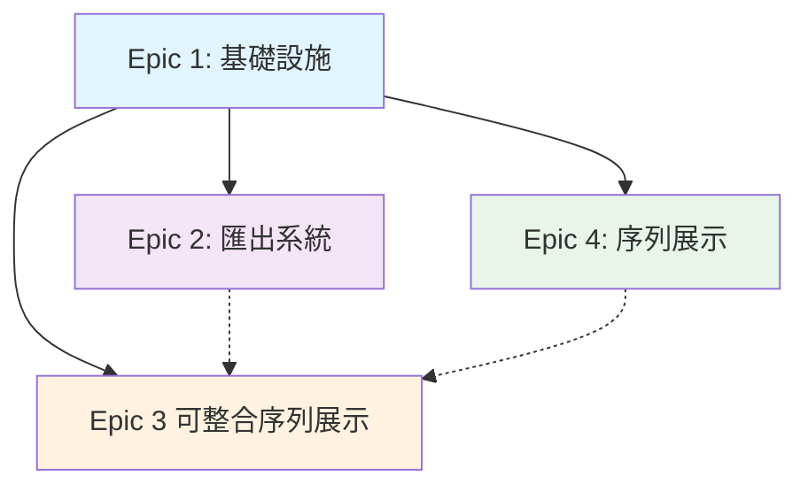

# Epic 順序優化與依賴關係分析

基於 PO 檢查清單的建議，本文件重新規劃 Epic 開發順序，優化依賴關係，確保開發流程順暢且風險可控。

## 🔄 原始 Epic 順序分析

### 原始順序問題

根據 PRD 原始設計：

1. **Epic 1**: 基礎設施與核心渲染引擎
2. **Epic 2**: 完美匯出系統
3. **Epic 3**: 複雜關聯線視覺優化
4. **Epic 4**: 革命性序列展示功能

**發現的問題**:

- Epic 4 (序列展示) 過度依賴 Epic 3 (關聯線優化)
- Epic 3 的複雜度可能成為開發瓶頸
- 缺乏漸進式價值交付路徑

## ✅ 優化後的 Epic 順序

### 新的開發順序

1. **Epic 1**: 基礎設施與核心渲染引擎 (不變)
2. **Epic 2**: 完美匯出系統 (不變)
3. **Epic 4**: 革命性序列展示功能 (提前)
4. **Epic 3**: 複雜關聯線視覺優化 (延後)

### 順序調整理由

#### 1. Epic 4 提前的優勢 ✅

- **獨立性強**: 序列展示基於基礎渲染即可實現
- **差異化價值**: 核心競爭優勢功能優先交付
- **使用者驗證**: 早期獲得使用者對創新功能的反饋
- **技術風險分散**: 避免同時處理兩個複雜技術挑戰

#### 2. Epic 3 延後的好處 ✅

- **非阻塞**: 不影響其他核心功能開發
- **技術成熟**: 基於穩定的渲染和序列展示功能優化
- **使用者驅動**: 基於實際使用反饋來設計優化策略
- **資源靈活**: 可在 MVP 完成後彈性調整投入

## 📊 依賴關係重新梳理

### Epic 間依賴圖

### 關鍵依賴分析

#### Epic 1 → Epic 2 (強依賴)

- **依賴內容**: 渲染引擎輸出 → 匯出處理
- **風險**: 低 (技術路徑清晰)
- **緩解**: 建立標準渲染輸出介面

#### Epic 1 → Epic 4 (中依賴)

- **依賴內容**: 基礎渲染 → 序列控制
- **風險**: 中 (需要擴展渲染引擎)
- **緩解**: 設計可擴展的渲染架構

#### Epic 4 → Epic 3 (弱依賴)

- **依賴內容**: 序列展示可增強關聯線體驗
- **風險**: 低 (獨立開發路徑)
- **緩解**: 定義清楚的整合接口

## 🎯 MVP 交付策略

### Phase 1: 核心 MVP (8-10 週)

**目標**: 建立可用的基礎產品

**包含 Epic**:

- ✅ Epic 1: 基礎設施與核心渲染引擎
- ✅ Epic 2: 完美匯出系統
- ✅ Epic 4: 革命性序列展示功能

**交付價值**:

- 穩定的 Mermaid 渲染
- 高品質圖表匯出
- 獨特的序列展示功能
- 完整的使用者體驗

### Phase 2: 優化增強 (4-6 週)

**目標**: 提升複雜場景使用體驗

**包含 Epic**:

- ✅ Epic 3: 複雜關聯線視覺優化

**交付價值**:

- 大型複雜圖表支援
- 更好的視覺體驗
- 進階佈局算法

## 📅 詳細開發排程

### Epic 1: 基礎設施與核心渲染引擎 (週 1-4)

**週 1-2**:

- Story 1.1: 專案基礎架構建立
- Story 1.2: 雙面板編輯器介面

**週 3-4**:

- Story 1.3: 基礎 Mermaid 渲染引擎
- Story 1.4: 智能語法容錯系統
- Story 1.5: 自適應節點系統

**里程碑**: 基礎編輯器和渲染功能完成

### Epic 2: 完美匯出系統 (週 3-6)

**週 3-4** (與 Epic 1 並行):

- Story 2.1: PNG 無截斷匯出引擎

**週 5-6**:

- Story 2.2: SVG 向量匯出
- Story 2.3: 匯出設定與預覽
- Story 2.4: 匯出效能優化

**里程碑**: 完整匯出功能上線

### Epic 4: 革命性序列展示功能 (週 5-8)

**週 5-6** (與 Epic 2 並行):

- Story 4.1: 序列展示核心引擎
- Story 4.2: 區域序列展示

**週 7-8**:

- Story 4.3: 節點序列展示
- Story 4.4: 關聯線序列展示
- Story 4.5: 序列展示控制介面
- Story 4.6: 序列展示模式整合

**里程碑**: MVP 核心功能完成

### Epic 3: 複雜關聯線視覺優化 (週 9-12)

**週 9-10**:

- Story 3.1: 多佈局引擎架構
- Story 3.2: 智能關聯線路徑優化

**週 11-12**:

- Story 3.3: 關聯線互動與高亮
- Story 3.4: 視覺樣式自定義

**里程碑**: 完整產品功能交付

## 🚦 風險管控策略

### 開發風險識別

#### 高風險項目

1. **序列展示技術實現** (Epic 4)
   - **風險**: 創新功能，技術路徑不明確
   - **緩解**: 早期技術原型驗證，分階段實現

2. **大型圖表渲染效能** (Epic 1)
   - **風險**: 效能瓶頸影響使用者體驗
   - **緩解**: 效能測試驅動開發，分塊處理策略

#### 中風險項目

3. **匯出系統穩定性** (Epic 2)
   - **風險**: 不同圖表類型匯出相容性
   - **緩解**: 全面測試覆蓋，漸進式功能發佈

4. **外部依賴整合** (所有 Epic)
   - **風險**: OpenAI API、Cloudinary 等服務整合問題
   - **緩解**: 完整的服務配置文件，備用方案

### 里程碑檢查點

#### 里程碑 1: 基礎功能 (週 4)

- [ ] 編輯器正常運作
- [ ] 基礎圖表渲染功能
- [ ] 程式碼品質標準達標
- [ ] CI/CD 流程建立

#### 里程碑 2: 核心價值 (週 6)

- [ ] 匯出功能完整
- [ ] 使用者體驗流暢
- [ ] 效能指標達標
- [ ] 基礎測試覆蓋

#### 里程碑 3: 差異化功能 (週 8)

- [ ] 序列展示功能完成
- [ ] MVP 功能完整
- [ ] E2E 測試通過
- [ ] 產品可部署上線

#### 里程碑 4: 優化完成 (週 12)

- [ ] 複雜關聯線優化
- [ ] 效能全面優化
- [ ] 完整產品交付
- [ ] 使用者驗收通過

## 📈 成功指標定義

### 技術指標

- **渲染效能**: < 500ms (100 節點圖表)
- **匯出成功率**: > 99%
- **程式碼覆蓋率**: > 80%
- **系統可用性**: > 99.5%

### 產品指標

- **使用者滿意度**: > 90%
- **功能完成度**: 100% (MVP 範圍)
- **缺陷密度**: < 1 缺陷/1000 行程式碼
- **發佈時程**: 按計畫交付 (±1 週容差)

### 業務指標

- **MVP 功能驗證**: 所有核心流程可正常使用
- **差異化價值**: 序列展示功能獲得正面使用者反饋
- **擴展準備**: Phase 2/3 功能接口完整預留
- **團隊效率**: 開發流程順暢，無重大阻塞

## 🎉 總結建議

### 為什麼這個順序更好？

1. **價值交付最大化** 📈
   - 核心差異化功能 (序列展示) 優先交付
   - 使用者早期獲得獨特價值體驗

2. **技術風險分散** 🛡️
   - 避免同時處理多個複雜技術挑戰
   - 每個 Epic 都有清晰的成功標準

3. **開發效率提升** ⚡
   - 減少跨 Epic 依賴造成的等待時間
   - 團隊可以並行開發不相關功能

4. **市場回應敏捷** 🚀
   - MVP 包含完整核心功能
   - 可根據市場反饋調整後續優化重點

### 行動建議

1. **立即執行**: 按照新順序更新 PRD 和開發計畫
2. **團隊同步**: 與開發團隊同步新的 Epic 優先順序
3. **資源調整**: 重新分配開發資源到優先 Epic
4. **風險監控**: 建立里程碑檢查機制，及時識別偏差

這個優化方案將讓 Mermaid-Render 專案以更高的效率和更低的風險交付核心價值，確保 MVP 成功並為後續發展奠定堅實基礎。

---

**文件版本**: v1.0  
**最後更新**: 2025-08-31  
**負責人**: 產品負責人 & 技術架構師
