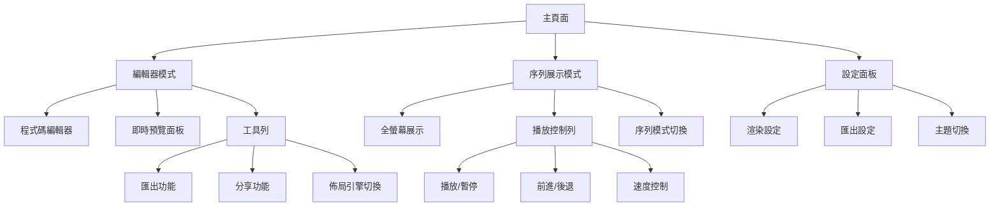
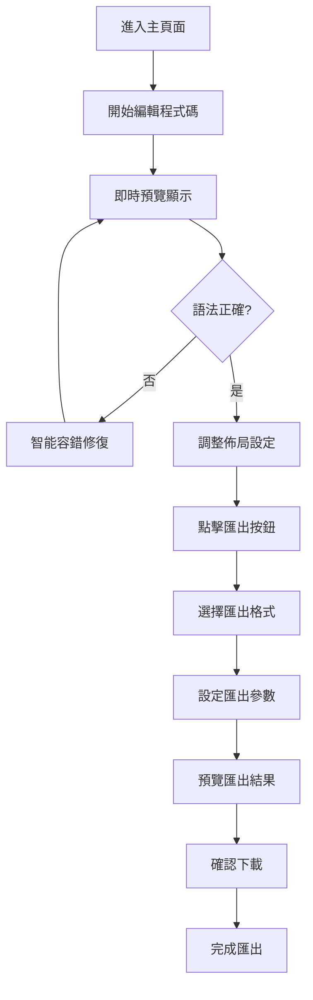
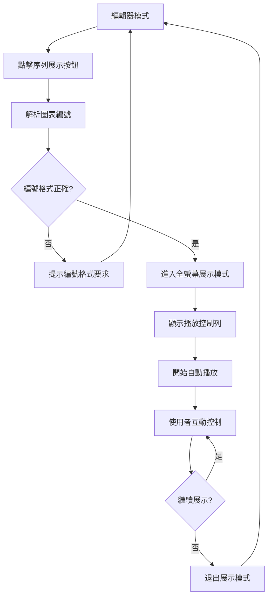

# Mermaid-Render UI/UX Specification

此文件定義 Mermaid-Render 使用者介面的使用者體驗目標、資訊架構、使用者流程和視覺設計規格。它作為視覺設計和前端開發的基礎，確保一致且以使用者為中心的體驗。

**專案背景**：Mermaid-Render 是一個 AI 驅動的高客製化圖表展示平台，主要解決現有 Mermaid 工具的語法容錯問題、PNG 匯出截斷問題，並提供革命性的序列展示功能。

**目標使用者**：技術文件撰寫者、專案經理、系統分析師、教育培訓人員

**核心差異化功能**：業界首創的編號序列展示模式，支援區域、節點、關聯線的依序互動展示

## 整體 UX 目標與原則

### 目標使用者人格 (Target User Personas)

**1. 技術文件撰寫者（Tech Writers）**
- **需求**：快速產出專業技術文件，減少圖表製作時間
- **痛點**：經常遇到 Mermaid 語法問題和渲染失敗
- **目標**：可靠的工具，支援複雜系統架構圖

**2. 專案經理（Project Managers）**
- **需求**：視覺化複雜業務流程和專案依賴關係
- **痛點**：現有工具無法處理大型複雜圖表
- **目標**：互動展示功能，支援演示和培訓場景

**3. 系統分析師（System Analysts）**
- **需求**：製作大型複雜的系統設計圖
- **痛點**：關聯線多，視覺混亂
- **目標**：清楚的關聯線視覺化

**4. 教育培訓人員（Educators）**
- **需求**：依序展示複雜概念和流程
- **痛點**：缺乏互動展示功能
- **目標**：序列展示功能，提升教學效果

### 可用性目標

1. **學習易用性**：新使用者能在 5 分鐘內完成基本圖表建立和匯出
2. **使用效率**：專業使用者能快速完成複雜圖表編輯（< 500ms 渲染延遲）
3. **錯誤預防**：智能語法容錯率達到 99%
4. **記憶性**：偶爾使用者回歸時不需重新學習
5. **滿意度**：使用者滿意度 > 90%

### 設計原則

1. **可靠性優於美觀** - 確保渲染穩定性和語法相容性
2. **即時回饋** - 每個操作都有清楚的即時反應（< 500ms）
3. **漸進式揭露** - 根據使用者需求層級顯示功能
4. **一致性模式** - 整體使用相同的互動模式
5. **無障礙優先** - 遵循 WCAG AA 標準

### 變更記錄

| 日期 | 版本 | 描述 | 作者 |
|------|------|------|------|
| 2025-08-31 | v1.0 | 初始 UI/UX 規格書建立 | Sally (UX Expert) |

## 資訊架構 (IA)

### 網站地圖 / 畫面清單

### 導航結構

**主要導航**：
- 頂部工具列：匯出、分享、設定、模式切換
- 側邊面板：檔案管理、歷史記錄（未來版本）

**次要導航**：
- 右鍵選單：複製、編輯、刪除操作
- 快速鍵：常用功能快捷操作

**麵包屑策略**：
- 編輯器模式：專案名稱 > 檔案名稱
- 序列展示模式：專案名稱 > 展示模式 > 當前步驟

## 使用者流程

### 流程 1：基本圖表建立與匯出

**使用者目標**：從零開始建立一個 Mermaid 圖表並匯出為 PNG

**進入點**：主頁面

**成功標準**：成功下載高品質 PNG 圖片

#### 流程圖

#### 邊界情況與錯誤處理：
- 語法錯誤：顯示友善錯誤訊息和修復建議
- 網路中斷：本地暫存功能，恢復連線後同步
- 大型圖表：分塊處理，顯示進度指示器
- 匯出失敗：提供重試選項和替代格式

**備註**：整個流程目標時間 < 5 分鐘

### 流程 2：序列展示模式

**使用者目標**：使用序列展示功能進行圖表演示

**進入點**：編輯器模式完成圖表後

**成功標準**：成功播放序列展示並能控制播放節奏

#### 流程圖

#### 邊界情況與錯誤處理：
- 無編號元素：提供編號指引和範例
- 編號不連續：智能跳過或提示修正
- 播放卡頓：調整動畫品質和速度
- 全螢幕問題：提供替代展示方案

## 線框圖與實體模型

### 設計檔案
**主要設計檔案**：使用 Figma 進行詳細視覺設計（待建立）

### 關鍵畫面配置

#### 主編輯器

**用途**：日常圖表編輯和預覽

**關鍵元素**：
- 左側：Monaco Editor 程式碼編輯器（可調整寬度）
- 右側：即時預覽面板（支援縮放和拖拽）
- 頂部：工具列（匯出、分享、設定、模式切換）
- 底部：狀態列（語法檢查、渲染狀態）

**互動備註**：
- 分隔線可拖拽調整面板比例
- 支援鍵盤快速鍵（Ctrl+S 儲存、Ctrl+Enter 渲染）
- 預覽面板支援滾輪縮放

#### 序列展示模式

**用途**：全螢幕圖表演示

**關鍵元素**：
- 中央：全螢幕圖表顯示區域
- 底部：播放控制列（播放/暫停、前進/後退、速度調整）
- 右上角：模式切換和設定
- 左下角：當前步驟指示器

**互動備註**：
- ESC 鍵退出全螢幕
- 空白鍵控制播放/暫停
- 左右方向鍵控制前進/後退

#### 匯出設定

**用途**：匯出前的參數調整和預覽

**關鍵元素**：
- 左側：格式選擇（PNG、SVG）
- 中央：解析度和品質設定
- 右側：即時預覽
- 底部：匯出按鈕和進度指示器

**互動備註**：
- 即時預覽匯出效果
- 預設配置快速選擇
- 批量匯出選項

## 元件庫 / 設計系統

### 設計系統方法
**設計系統方法**：採用 Radix UI 作為基礎，建立自定義主題系統，確保一致性和可維護性

### 核心元件

#### 按鈕元件
**用途**：所有可點擊操作

**變體**：
- Primary：主要操作（匯出、確認）
- Secondary：次要操作（取消、返回）
- Ghost：輕量操作（工具列按鈕）
- Icon：純圖示按鈕

**狀態**：Default、Hover、Active、Disabled、Loading

**使用指南**：Primary 按鈕每個區域最多一個，重要操作使用 Primary 樣式

#### 程式碼編輯器
**用途**：Mermaid 程式碼輸入

**變體**：
- Standard：標準編輯器
- Compact：緊湊模式（行號較小）

**狀態**：Normal、Focused、Error、Loading

**使用指南**：支援語法高亮、自動補全、錯誤提示

#### 預覽面板
**用途**：圖表即時預覽

**變體**：
- Standard：標準預覽
- Fullscreen：全螢幕預覽
- Export：匯出預覽

**狀態**：Loading、Rendered、Error、Empty

**使用指南**：支援縮放、拖拽、選取操作

#### 播放控制列
**用途**：序列展示控制

**變體**：
- Full：完整控制列
- Compact：精簡控制列

**狀態**：Playing、Paused、Loading、Error

**使用指南**：類似影片播放器的操作邏輯

## 品牌與樣式指南

### 視覺識別
**品牌指南**：專業、現代的設計風格，強調技術專業感和可靠性

### 色彩配置

| 色彩類型 | Hex Code | 用途 |
|---------|----------|------|
| Primary | #3B82F6 | 主要操作按鈕、連結、高亮元素 |
| Secondary | #64748B | 次要操作、邊框、分隔線 |
| Accent | #06B6D4 | 序列展示高亮、動畫元素 |
| Success | #10B981 | 成功狀態、確認訊息 |
| Warning | #F59E0B | 警告訊息、容錯提示 |
| Error | #EF4444 | 錯誤狀態、危險操作 |
| Neutral | #1E293B / #F8FAFC | 文字、背景、介面基調 |

### 字型系統

#### 字型家族
- **主要字型**：Inter（介面文字）
- **次要字型**：Inter（標題文字）
- **等寬字型**：JetBrains Mono（程式碼）

#### 字型階層

| 元素 | 大小 | 字重 | 行高 |
|------|------|------|------|
| H1 | 2rem | 600 | 1.2 |
| H2 | 1.5rem | 600 | 1.3 |
| H3 | 1.25rem | 500 | 1.4 |
| Body | 0.875rem | 400 | 1.5 |
| Small | 0.75rem | 400 | 1.4 |

### 圖示系統
**圖示庫**：Lucide React（一致的線性圖示風格）

**使用指南**：
- 24px 為標準尺寸
- 16px 用於小型按鈕
- 32px 用於強調元素
- 保持線寬一致性

### 間距與版面
**網格系統**：8px 基礎網格系統

**間距比例**：4px, 8px, 16px, 24px, 32px, 48px, 64px

## 無障礙性要求

### 合規目標
**標準**：WCAG 2.1 AA 級別合規

### 關鍵要求

**視覺**：
- 色彩對比度：文字 4.5:1，UI 元件 3:1
- 焦點指示器：2px 藍色邊框，清楚可見
- 文字縮放：支援 200% 放大而不失去功能

**互動**：
- 鍵盤導航：所有功能均可透過鍵盤操作
- 螢幕閱讀器支援：完整 ARIA 標籤和語義 HTML
- 觸控目標：最小 44x44px 點擊區域

**內容**：
- 替代文字：所有圖示和圖片提供描述
- 標題結構：正確的 H1-H6 階層
- 表單標籤：所有輸入欄位有明確標籤

### 測試策略
1. **自動化測試**：整合 axe-core 進行持續檢測
2. **鍵盤測試**：確保完整鍵盤導航路徑
3. **螢幕閱讀器測試**：使用 NVDA/JAWS 驗證
4. **色彩盲測試**：模擬各種色覺缺陷情況

## 響應式策略

### 中斷點

| 中斷點 | 最小寬度 | 最大寬度 | 目標裝置 |
|--------|----------|----------|----------|
| Mobile | 320px | 767px | 手機 |
| Tablet | 768px | 1023px | 平板 |
| Desktop | 1024px | 1439px | 桌機 |
| Wide | 1440px | - | 大螢幕 |

### 適應模式

**版面變化**：
- Mobile：單欄佈局，編輯器和預覽垂直堆疊
- Tablet：可切換的雙面板或全寬模式
- Desktop：標準雙面板佈局
- Wide：更寬的預覽區域，可選三欄佈局

**導航變化**：
- Mobile：漢堡選單，工具列摺疊
- Tablet：部分工具列，重要功能保留
- Desktop：完整工具列，所有功能可見

**內容優先級**：
1. 預覽面板（核心功能）
2. 基本編輯功能
3. 匯出功能
4. 進階設定

**互動變化**：
- Touch：增大點擊目標，支援手勢操作
- Mouse：精確操作，hover 效果
- Keyboard：完整快速鍵支援

## 動畫與微互動

### 動作原則
1. **有目的性**：每個動畫都有明確的功能目的
2. **性能優先**：60fps 流暢度，GPU 加速
3. **可控性**：支援 prefers-reduced-motion
4. **一致性**：統一的緩動函數和時長

### 關鍵動畫

- **頁面轉場**：300ms fade + slide，easing: ease-out
- **按鈕互動**：150ms scale + opacity，easing: ease-in-out
- **載入狀態**：無限旋轉，1.5s，linear
- **錯誤抖動**：300ms 水平抖動，easing: ease-in-out
- **序列展示**：500ms 淡入淡出，easing: ease-in-out
- **關聯線高亮**：200ms 色彩漸變，easing: ease-out

## 效能考量

### 效能目標
- **頁面載入**：< 2 秒（初始載入）
- **互動回應**：< 500ms（渲染延遲）
- **動畫 FPS**：60fps（所有動畫）

### 設計策略
1. **延遲載入**：非關鍵功能按需載入
2. **漸進式增強**：基礎功能優先，進階功能逐步啟用
3. **快取策略**：渲染結果本地快取
4. **資源優化**：圖示使用 SVG，字型子集化

## 下一步

### 立即行動
1. 建立 Figma 設計檔案並完成主要畫面設計
2. 建立設計 token 系統和元件庫
3. 進行使用者測試驗證核心流程
4. 建立無障礙性檢測流程

### 設計交接檢查清單
- [x] 所有使用者流程已文件化
- [x] 元件清單完整
- [x] 無障礙性要求已定義
- [x] 響應式策略明確
- [x] 品牌指南已整合
- [x] 效能目標已建立

### 檢查清單結果
本 UI/UX 規格書已完成所有必要章節，可作為設計和開發的基礎文件。建議接下來進行詳細的視覺設計和原型製作。