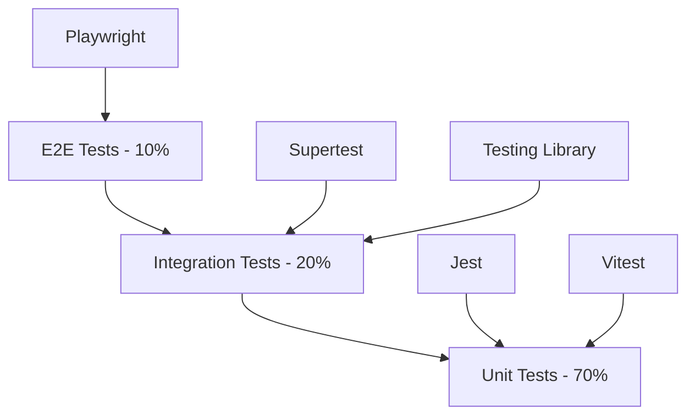

# 測試策略與框架

本文件定義 Mermaid-Render 專案的完整測試策略，包含測試金字塔、工具選擇、配置設定以及最佳實踐。

## 🎯 測試目標

### 品質目標
- **程式碼覆蓋率**: > 80% (單元測試)
- **功能覆蓋率**: > 95% (關鍵使用者流程)  
- **效能基準**: 渲染時間 < 500ms (100 節點圖表)
- **相容性**: 支援 Chrome 90+, Firefox 88+, Safari 14+
- **可靠性**: 99.5% 系統可用性

### 測試原則
1. **測試金字塔**: 70% 單元測試, 20% 整合測試, 10% E2E 測試
2. **左移測試**: 開發階段就發現和修復缺陷
3. **自動化優先**: 所有回歸測試自動化執行
4. **真實環境**: 測試環境盡可能接近生產環境
5. **快速回饋**: 測試套件執行時間 < 10 分鐘

## 🏗️ 測試架構

### 測試分層策略



### 1. 單元測試 (70%) - Jest + Testing Library

**目標**: 測試個別函數、組件、類別的邏輯
**覆蓋範圍**: 
- React 組件行為
- 業務邏輯函數
- 工具函數和 Hooks
- API 路由處理器
- 資料模型和驗證

**配置文件**: `jest.config.js`
```javascript
const nextJest = require('next/jest')

const createJestConfig = nextJest({
  dir: './',
})

const customJestConfig = {
  setupFilesAfterEnv: ['<rootDir>/jest.setup.js'],
  testEnvironment: 'jest-environment-jsdom',
  collectCoverageFrom: [
    'src/**/*.{js,jsx,ts,tsx}',
    'server/src/**/*.{js,ts}',
    '!**/*.d.ts',
    '!**/node_modules/**',
  ],
  coverageThreshold: {
    global: {
      branches: 80,
      functions: 80,
      lines: 80,
      statements: 80,
    },
  },
  testMatch: [
    '<rootDir>/__tests__/**/*.test.{js,jsx,ts,tsx}',
    '<rootDir>/src/**/__tests__/**/*.test.{js,jsx,ts,tsx}',
    '<rootDir>/server/**/__tests__/**/*.test.{js,ts}',
  ],
  moduleNameMapping: {
    '^@/(.*)$': '<rootDir>/src/$1',
    '^@server/(.*)$': '<rootDir>/server/src/$1',
  },
}

module.exports = createJestConfig(customJestConfig)
```

### 2. 整合測試 (20%) - Supertest + Testing Library

**目標**: 測試組件間互動和 API 端點
**覆蓋範圍**:
- API 端點功能
- 資料庫操作
- 外部服務整合
- 組件間互動
- 狀態管理整合

**配置範例**:
```typescript
// __tests__/integration/api/render.test.ts
import request from 'supertest'
import { app } from '@server/app'
import { setupTestDatabase } from '@server/test/setup'

describe('Render API Integration', () => {
  beforeAll(async () => {
    await setupTestDatabase()
  })

  test('POST /api/render should process mermaid code', async () => {
    const response = await request(app)
      .post('/api/render')
      .send({
        code: 'graph TD\n  A --> B',
        options: { theme: 'dark' }
      })
      .expect(200)

    expect(response.body).toEqual(
      expect.objectContaining({
        success: true,
        svg: expect.stringContaining('<svg'),
        metadata: expect.objectContaining({
          chartType: 'graph',
          renderTime: expect.any(Number)
        })
      })
    )
  })
})
```

### 3. 端到端測試 (10%) - Playwright

**目標**: 測試完整使用者流程
**覆蓋範圍**:
- 關鍵使用者旅程
- 跨瀏覽器相容性
- 效能基準測試
- 視覺回歸測試

**配置文件**: `playwright.config.ts`
```typescript
import { defineConfig, devices } from '@playwright/test'

export default defineConfig({
  testDir: './e2e',
  fullyParallel: true,
  forbidOnly: !!process.env.CI,
  retries: process.env.CI ? 2 : 0,
  workers: process.env.CI ? 1 : undefined,
  reporter: [
    ['html'],
    ['junit', { outputFile: 'test-results/junit.xml' }]
  ],
  use: {
    baseURL: 'http://localhost:3000',
    trace: 'on-first-retry',
    screenshot: 'only-on-failure',
  },

  projects: [
    {
      name: 'chromium',
      use: { ...devices['Desktop Chrome'] },
    },
    {
      name: 'firefox', 
      use: { ...devices['Desktop Firefox'] },
    },
    {
      name: 'webkit',
      use: { ...devices['Desktop Safari'] },
    },
    {
      name: 'Mobile Chrome',
      use: { ...devices['Pixel 5'] },
    },
    {
      name: 'Mobile Safari',
      use: { ...devices['iPhone 12'] },
    },
  ],

  webServer: {
    command: 'npm run dev',
    port: 3000,
    reuseExistingServer: !process.env.CI,
  },
})
```

## 🧪 測試類型詳解

### 前端測試

#### React 組件測試
```typescript
// __tests__/components/CodeEditor.test.tsx
import { render, screen, fireEvent } from '@testing-library/react'
import userEvent from '@testing-library/user-event'
import { CodeEditor } from '@/components/editor/CodeEditor'

describe('CodeEditor', () => {
  test('should render Monaco editor', () => {
    render(<CodeEditor />)
    
    const editor = screen.getByRole('textbox')
    expect(editor).toBeInTheDocument()
  })

  test('should handle code input and emit changes', async () => {
    const user = userEvent.setup()
    const mockOnChange = jest.fn()
    
    render(<CodeEditor onChange={mockOnChange} />)
    
    const editor = screen.getByRole('textbox')
    await user.type(editor, 'graph TD\n  A --> B')
    
    expect(mockOnChange).toHaveBeenCalledWith('graph TD\n  A --> B')
  })

  test('should display syntax errors', async () => {
    render(<CodeEditor />)
    
    const editor = screen.getByRole('textbox')
    await user.type(editor, 'invalid syntax')
    
    expect(screen.getByRole('alert')).toHaveTextContent('語法錯誤')
  })
})
```

#### Hooks 測試
```typescript
// __tests__/hooks/useMermaidRenderer.test.tsx
import { renderHook, waitFor } from '@testing-library/react'
import { useMermaidRenderer } from '@/hooks/useMermaidRenderer'

describe('useMermaidRenderer', () => {
  test('should render mermaid code', async () => {
    const { result } = renderHook(() => useMermaidRenderer())
    
    act(() => {
      result.current.render('graph TD\n  A --> B')
    })
    
    await waitFor(() => {
      expect(result.current.state).toBe('success')
      expect(result.current.svg).toContain('<svg')
    })
  })

  test('should handle render errors', async () => {
    const { result } = renderHook(() => useMermaidRenderer())
    
    act(() => {
      result.current.render('invalid mermaid')
    })
    
    await waitFor(() => {
      expect(result.current.state).toBe('error')
      expect(result.current.error).toBeDefined()
    })
  })
})
```

### 後端測試

#### API 端點測試
```typescript
// server/__tests__/routes/render.test.ts
import { FastifyInstance } from 'fastify'
import { build } from '@server/app'

describe('Render Routes', () => {
  let app: FastifyInstance

  beforeAll(async () => {
    app = build({ logger: false })
    await app.ready()
  })

  afterAll(async () => {
    await app.close()
  })

  test('GET /health should return 200', async () => {
    const response = await app.inject({
      method: 'GET',
      url: '/health'
    })

    expect(response.statusCode).toBe(200)
    expect(response.json()).toEqual({ status: 'ok' })
  })

  test('POST /api/render with valid mermaid', async () => {
    const response = await app.inject({
      method: 'POST',
      url: '/api/render',
      payload: {
        code: 'graph TD\n  A --> B',
        options: { theme: 'dark' }
      }
    })

    expect(response.statusCode).toBe(200)
    const result = response.json()
    expect(result.success).toBe(true)
    expect(result.svg).toContain('<svg')
  })
})
```

#### 服務層測試
```typescript
// server/__tests__/services/RenderService.test.ts
import { RenderService } from '@server/services/RenderService'
import { mockMermaidParser } from '@server/test/mocks'

jest.mock('@server/lib/mermaid-parser')

describe('RenderService', () => {
  let renderService: RenderService

  beforeEach(() => {
    renderService = new RenderService(mockMermaidParser)
  })

  test('should render simple flowchart', async () => {
    const code = 'graph TD\n  A --> B'
    const result = await renderService.renderMermaid(code)

    expect(result.success).toBe(true)
    expect(result.metadata.chartType).toBe('graph')
  })

  test('should cache render results', async () => {
    const code = 'graph TD\n  A --> B'
    
    // 第一次渲染
    await renderService.renderMermaid(code)
    // 第二次應該來自快取
    const result = await renderService.renderMermaid(code)
    
    expect(mockMermaidParser.parse).toHaveBeenCalledTimes(1)
  })
})
```

### E2E 測試

#### 關鍵使用者流程測試
```typescript
// e2e/editor-workflow.spec.ts
import { test, expect } from '@playwright/test'

test('完整編輯器工作流程', async ({ page }) => {
  // 訪問主頁
  await page.goto('/')
  
  // 等待編輯器載入
  await expect(page.getByTestId('monaco-editor')).toBeVisible()
  
  // 輸入 Mermaid 程式碼
  await page.getByTestId('monaco-editor').click()
  await page.keyboard.type('graph TD\n  A --> B\n  B --> C')
  
  // 等待預覽渲染
  await expect(page.getByTestId('preview-panel')).toContainText('svg')
  
  // 測試序列展示功能
  await page.getByTestId('sequence-mode-btn').click()
  await expect(page.getByTestId('sequence-controls')).toBeVisible()
  
  // 測試匯出功能
  await page.getByTestId('export-btn').click()
  await page.getByTestId('export-png').click()
  
  // 驗證下載
  const downloadPromise = page.waitForEvent('download')
  await page.getByTestId('confirm-export').click()
  const download = await downloadPromise
  expect(download.suggestedFilename()).toBe('mermaid-chart.png')
})
```

#### 效能測試
```typescript
// e2e/performance.spec.ts
import { test, expect } from '@playwright/test'

test('渲染效能基準測試', async ({ page }) => {
  await page.goto('/')
  
  // 大型圖表測試
  const largeChart = `graph TD
    ${Array.from({ length: 100 }, (_, i) => `A${i} --> B${i}`).join('\n')}
  `
  
  const startTime = Date.now()
  
  await page.getByTestId('monaco-editor').click()
  await page.keyboard.type(largeChart)
  
  // 等待渲染完成
  await expect(page.getByTestId('preview-panel')).toContainText('svg')
  
  const renderTime = Date.now() - startTime
  expect(renderTime).toBeLessThan(2000) // 2 秒內完成
})
```

## 🔧 測試工具配置

### Jest 設定檔
```javascript
// jest.setup.js
import '@testing-library/jest-dom'
import 'jest-canvas-mock'

// Mock IntersectionObserver
global.IntersectionObserver = class IntersectionObserver {
  constructor() {}
  observe() { return null }
  disconnect() { return null }
  unobserve() { return null }
}

// Mock ResizeObserver  
global.ResizeObserver = class ResizeObserver {
  constructor(cb) { this.cb = cb }
  observe() { return null }
  unobserve() { return null }
  disconnect() { return null }
}

// Mock Monaco Editor
jest.mock('monaco-editor/esm/vs/editor/editor.api', () => ({
  editor: {
    create: jest.fn(() => ({
      getValue: jest.fn(() => ''),
      setValue: jest.fn(),
      onDidChangeModelContent: jest.fn(),
      dispose: jest.fn()
    })),
    setTheme: jest.fn()
  },
  languages: {
    register: jest.fn(),
    setLanguageConfiguration: jest.fn()
  }
}))
```

### 測試資料庫設定
```typescript
// server/test/setup.ts
import { PrismaClient } from '@prisma/client'
import { execSync } from 'child_process'
import { join } from 'path'

const prisma = new PrismaClient()

export async function setupTestDatabase() {
  // 執行測試資料庫遷移
  const schemaPath = join(__dirname, '../prisma/schema.prisma')
  execSync(`npx prisma migrate reset --force --schema=${schemaPath}`, {
    env: {
      ...process.env,
      DATABASE_URL: process.env.TEST_DATABASE_URL
    }
  })
  
  // 載入測試資料
  await seedTestData()
}

export async function seedTestData() {
  await prisma.user.createMany({
    data: [
      {
        email: 'test@example.com',
        name: 'Test User',
        plan: 'free'
      },
      {
        email: 'premium@example.com', 
        name: 'Premium User',
        plan: 'premium'
      }
    ]
  })
}

export async function cleanupTestDatabase() {
  await prisma.$transaction([
    prisma.project.deleteMany(),
    prisma.user.deleteMany(),
  ])
}
```

## 📊 測試覆蓋率與品質

### 覆蓋率配置
```json
// package.json
{
  "scripts": {
    "test": "jest",
    "test:watch": "jest --watch",
    "test:coverage": "jest --coverage",
    "test:frontend": "jest --testPathPattern='src/'",
    "test:backend": "jest --testPathPattern='server/'",
    "test:integration": "jest --testPathPattern='integration'",
    "test:e2e": "playwright test",
    "test:all": "npm run test:frontend && npm run test:backend && npm run test:e2e"
  },
  "jest": {
    "collectCoverageFrom": [
      "src/**/*.{js,jsx,ts,tsx}",
      "server/src/**/*.{js,ts}",
      "!**/*.d.ts",
      "!**/node_modules/**",
      "!**/__tests__/**",
      "!**/coverage/**"
    ],
    "coverageReporters": ["text", "lcov", "html"],
    "coverageDirectory": "coverage"
  }
}
```

### 品質檢查
```bash
# 執行所有品質檢查
npm run quality:check

# 腳本內容：
# 1. 類型檢查
npx tsc --noEmit

# 2. 程式碼檢查  
npm run lint

# 3. 測試覆蓋率
npm run test:coverage

# 4. 安全性掃描
npm audit

# 5. 依賴檢查
npx depcheck
```

## 🚀 測試最佳實踐

### 1. 測試命名規範
```typescript
// ✅ 好的命名
describe('UserService', () => {
  describe('when creating a user', () => {
    test('should create user with valid data', () => {})
    test('should throw error when email already exists', () => {})
    test('should hash password before saving', () => {})
  })
})

// ❌ 不好的命名  
describe('UserService', () => {
  test('test1', () => {})
  test('user creation', () => {})
})
```

### 2. Mock 策略
```typescript
// ✅ 依賴注入 Mock
const mockRenderService = {
  renderMermaid: jest.fn(),
  generateSequence: jest.fn(),
}

// ✅ 模組 Mock
jest.mock('@/lib/mermaid', () => ({
  render: jest.fn(() => Promise.resolve({ svg: '<svg></svg>' }))
}))

// ❌ 避免過度 Mock
// 不要 Mock 你要測試的東西
```

### 3. 測試資料管理
```typescript
// ✅ 使用 Factory Pattern
const createUser = (overrides = {}) => ({
  id: '1',
  email: 'test@example.com',
  name: 'Test User',
  ...overrides
})

// ✅ 使用 Builder Pattern
class ProjectBuilder {
  private project = {
    id: '1',
    name: 'Test Project',
    mermaidCode: 'graph TD\n  A --> B'
  }
  
  withName(name: string) {
    this.project.name = name
    return this
  }
  
  build() {
    return { ...this.project }
  }
}
```

### 4. 異步測試
```typescript
// ✅ 正確處理異步
test('should render mermaid after delay', async () => {
  const promise = renderMermaid('graph TD\n  A --> B')
  
  // 驗證 loading 狀態
  expect(screen.getByText('Loading...')).toBeInTheDocument()
  
  const result = await promise
  
  // 驗證最終結果
  expect(result.success).toBe(true)
  expect(screen.getByTestId('rendered-svg')).toBeInTheDocument()
})

// ❌ 忘記等待異步操作
test('should render mermaid', () => {
  renderMermaid('graph TD\n  A --> B') // 沒有 await
  expect(screen.getByTestId('rendered-svg')).toBeInTheDocument() // 可能失敗
})
```

## 🔍 測試報告與監控

### 測試報告生成
```bash
# 生成 HTML 覆蓋率報告
npm run test:coverage
open coverage/lcov-report/index.html

# 生成 JUnit 測試報告 (CI/CD)
npm run test -- --ci --coverage --testResultsProcessor=jest-junit
```

### CI/CD 整合
```yaml
# GitHub Actions 測試步驟
- name: Run tests
  run: |
    npm run test:coverage
    npm run test:e2e

- name: Upload coverage
  uses: codecov/codecov-action@v3
  with:
    files: ./coverage/lcov.info
```

### 測試度量監控
- **執行時間**: 單元測試 < 5 分鐘, E2E 測試 < 15 分鐘
- **成功率**: > 98% (排除基礎建設問題)  
- **覆蓋率趨勢**: 維持或提升覆蓋率
- **缺陷密度**: < 1 缺陷/1000 行程式碼

---

**文件版本**: v1.0  
**最後更新**: 2025-08-31  
**維護者**: QA 團隊

這個測試策略將隨專案發展持續演進，確保測試覆蓋率和品質始終符合專案需求。